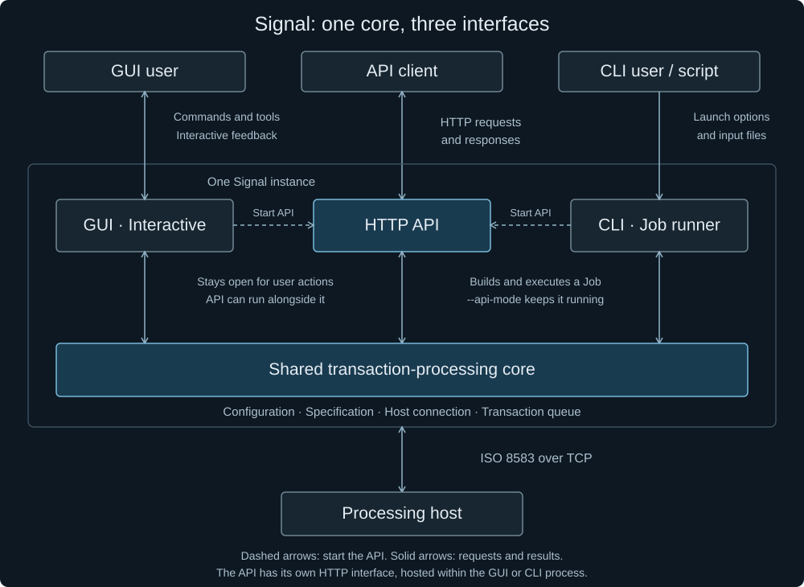
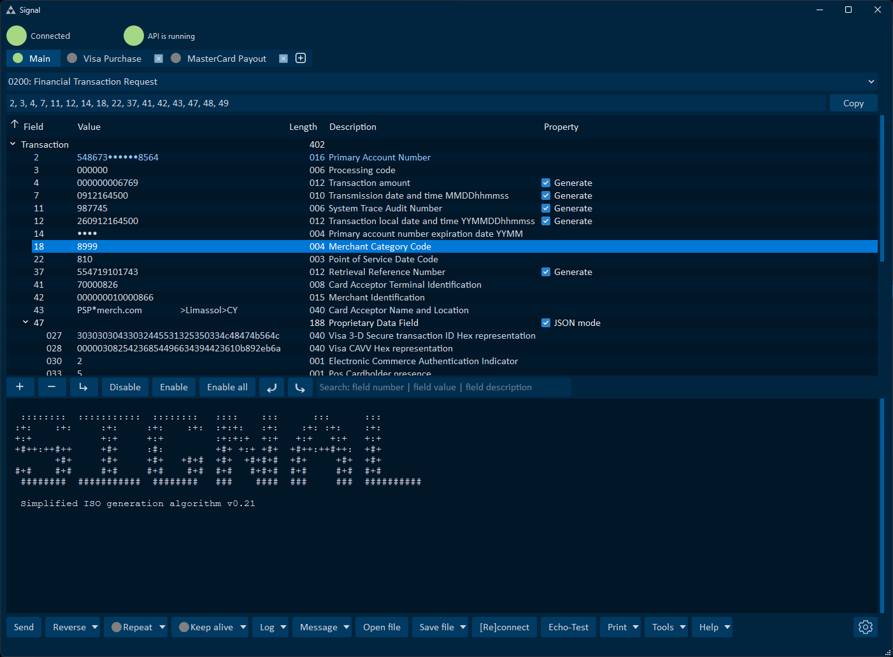
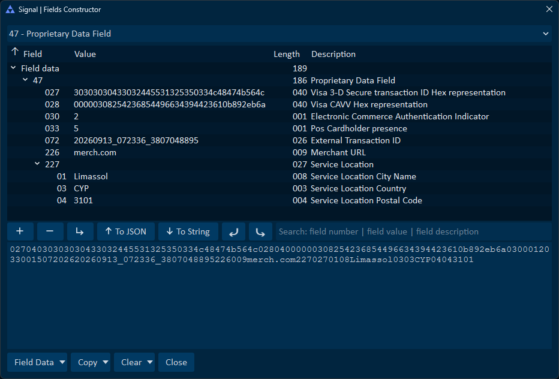
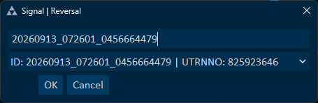
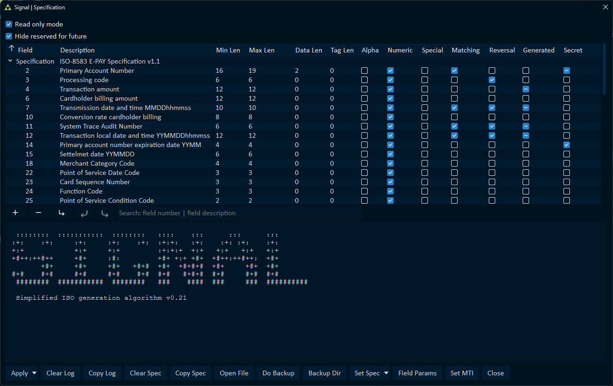
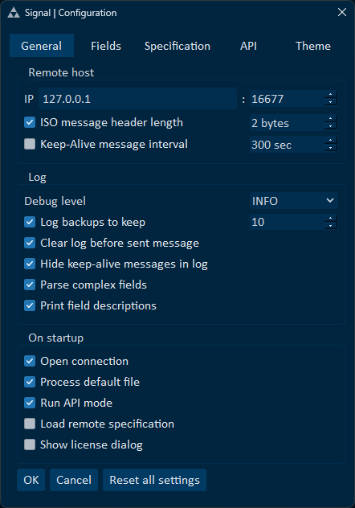
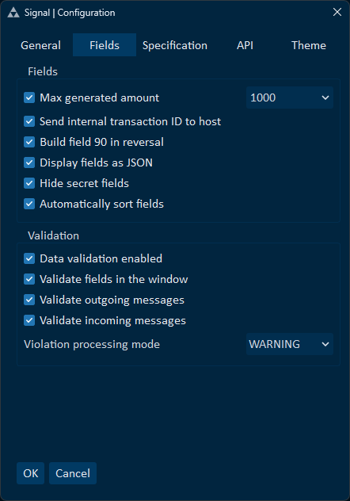
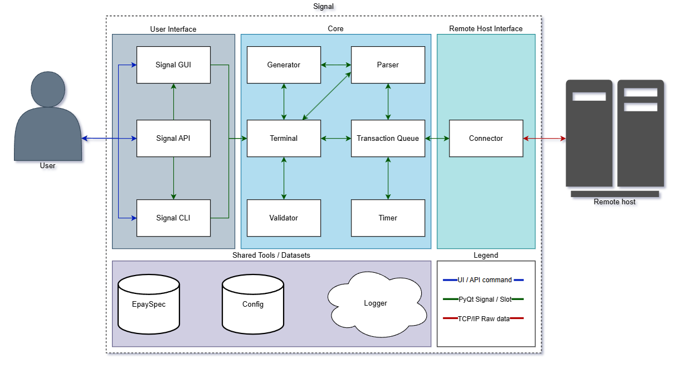

<p align="center"></p>

<h1 align="center">Signal user reference guide</h1>
<p align="center">This guide describes Signal's basic concepts, usage, settings, and use as a library. <br><br>
This document is under development.</p> 


<details>
<summary>Contents</summary>

- [Signal](#signal)
    - [Signal general overview](#signal-general-overview)
    - [Important notes](#important-notes)
    - [Release info](#release-info)
        - [Signal v0.21](#signal-v021)

- [How Signal works](#how-signal-works)
    - [One core, three interfaces](#one-core-three-interfaces)
    - [Interactive work and CLI jobs](#interactive-work-and-cli-jobs)
    - [What the core does](#what-the-core-does)
    - [One running instance, shared state](#one-running-instance-shared-state)

- [Graphical User Interface](#graphical-user-interface)
    - [GUI overview](#gui-overview)
        - [Your first transaction](#your-first-transaction)
    - [Main Window](#main-window)
        - [Main window overview](#main-window-overview)
        - [Transaction tabs](#transaction-tabs)
        - [Editing transaction fields](#editing-transaction-fields)
        - [Search line](#search-line)
        - [Field generators](#field-generators)
        - [GUI field validation](#gui-field-validation)
        - [Complex field constructor](#complex-field-constructor)
        - [Sending and reviewing results](#sending-and-reviewing-results)
        - [Reversal](#reversal)
        - [Repetition and connection tests](#repetition-and-connection-tests)
        - [Files and printable data](#files-and-printable-data)
        - [Using the API alongside the GUI](#using-the-api-alongside-the-gui)
    - [Example: purchase, response, and reversal](#example-purchase-response-and-reversal)
    - [Specification Window](#specification-window)
    - [Settings Window](#settings-window)
        - [Fields and validation settings](#fields-and-validation-settings)
    - [Windows hotkeys](#windows-hotkeys)

- [HTTP Transaction API](#http-transaction-api)
    - [Short API reference](#short-api-reference)
    - [Interactive API documentation](#interactive-api-documentation)
        - [Sending a request from Swagger UI](#sending-a-request-from-swagger-ui)
    - [Postman collection](#postman-collection)

- [Command Line Interface](#command-line-interface)
    - [CLI usage](#cli-usage)
        - [Options](#options)
        - [File processing and timing](#file-processing-and-timing)
        - [Configuration and startup](#configuration-and-startup)
    - [CLI examples](#cli-examples)
        - [Command examples](#command-examples)
    - [Running and controlling Signal through the API](#running-and-controlling-signal-through-the-api)
        - [Starting the API server](#starting-the-api-server)
        - [Operating the running instance](#operating-the-running-instance)
    - [CLI output](#cli-output)
        - [CLI Job ID](#cli-job-id)
        - [CLI output examples](#cli-output-examples)

- [Using Signal as a library](#using-signal-as-a-library)

- [Data models](#data-models)
    - [Transaction](#model-transaction)
    - [TransactionResp](#model-transactionresp)
    - [Connection](#model-connection)
    - [Config](#model-config)
    - [Host](#model-host)
    - [Terminal](#model-terminal)
    - [Debug](#model-debug)
    - [Validation](#model-validation)
    - [Fields](#model-fields)
    - [Specification](#model-specification)
    - [ApiModel](#model-apimodel)
    - [Theme](#model-theme)
    - [EpaySpecModel](#model-epayspecmodel)
    - [Mti](#model-mti)
    - [IsoField](#model-isofield)
    - [Validators](#model-validators)
    - [LogicalValidators](#model-logicalvalidators)
    - [ExceptionContent](#model-exceptioncontent)
    - [Transaction collection](#model-transactionmap)
    - [Validation messages](#model-validationmessages)
    - [Request validation error](#model-requestvalidationerror)
    - [API parameter values](#model-apiparameters)

- [Specification settings](#specification-settings)
    - [Specification Overview](#specification-overview)
    - [Settings description](#settings-description)
        - [Complex field lengths](#complex-field-lengths)
        - [Editing controls](#editing-controls)
        - [Applying changes](#applying-changes)
    - [Specification backup](#specification-backup)
    - [Remote specification](#remote-specification)
    - [Setting up a remote specification endpoint](#setting-up-a-remote-specification-endpoint)
    - [Remote spec endpoint code example](#remote-spec-endpoint-code-example)

- [Field validation](#field-validation)
    - [Main validation](#main-validation)
    - [Extended validation](#extended-validation)
        - [Exact values and text patterns](#exact-values-and-text-patterns)
        - [Logical and dictionary checks](#logical-and-dictionary-checks)
    - [Violation mode](#violation-mode)
    - [When validation runs](#when-validation-runs)
        - [Automatic checks and their settings](#automatic-checks-and-their-settings)
        - [Checking fields manually in the GUI](#checking-fields-manually-in-the-gui)
        - [Validation through the API](#validation-through-the-api)
    - [Complex fields representation](#complex-fields-representation)
    - [Formatting and validation](#formatting-and-validation)
    - [Validation bypass and limitations](#validation-bypass-and-limitations)

- [Configuration](#configuration)
    - [Config overview](#config-overview)
    - [Config file](#config-file)
    - [Configuration groups](#configuration-groups)
    - [Changing and saving settings](#changing-and-saving-settings)
    - [When changes take effect](#when-changes-take-effect)
    - [Restoring settings](#restoring-settings)

- [Transaction data files](#transaction-data-files)
    - [Data files overview](#data-files-overview)
    - [Data format descriptions](#data-format-descriptions)
    - [The same transaction in three formats](#the-same-transaction-in-three-formats)
        - [JSON file example](#json-file-example)
        - [INI file example](#ini-file-example)
        - [DUMP file example](#dump-file-example)
    - [Loading data into Signal](#loading-data-into-signal)
    - [Saving a transaction to a file](#saving-a-transaction-to-a-file)

- [Data storage](#data-storage)
    - [Default messages](#default-messages)
    - [Predefined API transactions](#predefined-api-transactions)
    - [Dictionaries](#dictionaries)
    - [License info](#license-info)
    - [Settings storage](#settings-storage)
    - [Specification backup](#specification-backup-1)
    - [Postman files](#postman-files)
    - [GUI resources and layout](#gui-resources-and-layout)

- [Logging](#logging)
    - [Log levels](#log-levels)
    - [Storage and rotation](#storage-and-rotation)
    - [Viewing logs in a browser](#viewing-logs-in-a-browser)
        - [Live log viewer](#live-log-viewer)
    - [Transaction detail and troubleshooting](#transaction-detail-and-troubleshooting)
    - [Hide secrets](#hide-secrets)

- [Bugs](#bugs)
    - [List of known bugs](#list-of-known-bugs)

- [About Signal](#about-signal)
    - [Concept](#concept)
    - [License](#license)
    - [Resources](#resources)
    - [Support](#support)
    - [Author](#author)

</details>

# Signal

## Signal general overview

Signal provides graphical and programmatic interfaces for sending e-commerce card transactions to card processing
systems. It sends transactions using the ISO-8583 E-pay protocol rather than through a PSP.
Signal can be used for payment system certification testing, system checks and configuration in test environments,
and application development.

Signal provides three interfaces to a shared transaction-processing core:

* **GUI** — an interactive workspace where you prepare transactions, use tools, and inspect results. It stays open for your next action.
* **CLI** — a job runner that takes launch options and input files, performs the requested work, and normally exits when finished.
* **HTTP API** — an interface for other applications to send transactions and control Signal through HTTP requests. It runs within a GUI or CLI instance; in GUI mode, it can operate alongside the window.

The shared core and the way these interfaces work together are described in [How Signal works](#how-signal-works).

If you have any questions about Signal, [contact the author](#author). Your feedback and suggestions help shape
Signal's development.

## Important notes

* For use in test environments only. Signal implements only basic security checks
* Signal does not currently support byte fields
* The GUI has been tested only on Windows 10/11 x64
* The application and this documentation are under development


## Release info

### Signal v0.21

* **New features**
    * Color customization with live preview
    * Resizable field and log panels
    * Drag-and-drop support for transactions and configuration data
    * Undo and redo in the complex field constructor
    * Specification recovery from backups

* **Updates**
    * Improved interface, keyboard navigation and error reporting
    * Consistent configuration updates across GUI and API
    * Core code cleanup and reliability improvements

* **Fixed**
    * TCP message handling and response matching
    * Configuration and specification saving issues
    * Various editing, display and connection shutdown issues


# How Signal works

## One core, three interfaces

Signal's central concept is a **shared transaction-processing core, accessible through three interfaces: GUI, CLI, and HTTP API**. The interface determines how you give Signal instructions and receive results. The core provides the transaction handling behind those instructions: field generation and validation, ISO 8583 encoding and decoding, host communication, and tracking requests and responses.



The processing host does not need to know whether a transaction originated in the GUI, CLI, or API. It receives an ISO 8583 message from Signal and returns its response over the host connection. The core decodes that response and matches it to the request; the interface determines how the result is presented or returned.

| Interface | How you receive the result |
|---|---|
| GUI | Inspect the transaction outcome and response details in the application and its log. |
| CLI | Follow transaction processing and responses in the console or log file. |
| HTTP API | Receive an HTTP response. Depending on configuration, this contains the host's transaction response or an immediate acceptance message; acceptance alone is not the host's transaction result. |

The diagram shows the interfaces of a single Signal instance. The **HTTP API has its own request/response interface**, but it is hosted within a GUI or CLI process. Dashed arrows labelled **Start API** show that either launch mode can start the API; solid arrows show transaction requests and results through the shared core. In GUI mode, the window and API can work concurrently. In CLI mode, Signal either executes transaction commands or hosts the API with `--api-mode`. All paths use the same host connection; the diagram does not imply that GUI and CLI command execution run together in one process.

| Interface | How you work with Signal | Typical use |
|---|---|---|
| [GUI](#graphical-user-interface) | Edit fields, use buttons and menus, and inspect transactions and logs in the application window. | Prepare a test transaction and investigate its response interactively. |
| [CLI](#command-line-interface) | Start Signal with command-line options to process files, repeat transactions, or host the API without opening the GUI. | Run a prepared test from a terminal or script. |
| [HTTP API](#http-transaction-api) | Send HTTP requests from another program, Swagger UI, or an API client. | Automate transaction submission and control the running Signal instance. |

## Interactive work and CLI jobs

Each interface receives work from a client. A GUI user gives individual commands through the window and its tools, with feedback after each action. A CLI user or script supplies launch options and input files; Signal uses those instructions to assemble and execute a job. An API client supplies HTTP requests.

The GUI and CLI have different lifecycles. The **GUI is an ongoing workspace for a person**: you prepare a transaction, send it, inspect the result, and continue working. Completing an operation does not close the application; the window remains available for the next user action. When enabled, the API can handle requests alongside that interactive work.

The **CLI executes a job defined by its launch options**. It takes the supplied parameters and transaction files, performs the requested work, and normally exits when that work is complete, including any required response waits. Each run has a [CLI Job ID](#cli-job-id), recorded in its begin and finish log markers. A CLI job can contain one transaction or a sequence of transactions; it is not a persistent interactive workspace.

Some jobs are deliberately long-running: `--repeat` continues processing transactions, while `--api-mode` keeps Signal available for HTTP requests. These jobs remain active until stopped, typically with **Ctrl + C**. They retain the same Job ID for the entire run.

## What the core does

The core uses the active configuration and specification to interpret transaction data and communicate with the processing host. Its shared capabilities include:

* Generating field values and checking transactions against specification rules.
* Encoding transactions into ISO 8583 messages and decoding incoming messages, including complex fields.
* Maintaining the host connection, sending messages, tracking transactions, and matching responses to requests.
* Supporting reversals, keep-alive sending, and logging.

For example, an operator can prepare a purchase in the GUI, a script can submit a transaction file through the CLI, or an API client can post a Transaction JSON object. Each route reaches the same underlying transaction-processing capabilities. The interface still matters: available controls, validation triggers, and the way results are presented differ. See [When validation runs](#when-validation-runs) for those distinctions.

## One running instance, shared state

The API operates within a running Signal instance. You can enable it alongside the GUI or start it through [CLI API mode](#running-and-controlling-signal-through-the-api). It uses that instance's active configuration, specification, host connection, and transaction queue.

For example, if Signal is running with the GUI and API enabled, an API request to disconnect the processing host affects the connection used by that GUI. The API is a way to operate the same application, not a separate connection to the processor. In CLI API mode, this relationship is unchanged; the application simply runs without its graphical window.

The HTTP API and the host connection are different links: an API client talks to Signal over HTTP, while Signal exchanges ISO 8583 messages with the processing host over TCP. Starting another Signal process creates another running instance; it does not attach a CLI to an already open GUI.

This shared-core design describes how the application works today. Direct use as a Python library is [being reworked](#using-signal-as-a-library) and is not presented here as an additional supported interface.

# Graphical User Interface

## GUI overview

The GUI is Signal's interactive workspace for preparing, sending, and investigating test transactions. You can build a message field by field, load an existing example, change a few values, and examine the response without writing a script or making API requests. The window remains open after each operation so that you can continue testing.

Start `signal.exe` to open the GUI. Before sending, configure the processing host through **Tools → Settings** and make sure the active specification matches that host. A supplied transaction is a starting point; its merchant, terminal, and card data may need to be adjusted for your test environment.



### Your first transaction

1. Open **Tools → Settings** and check the processing host address and port. Review the specification settings if your environment uses a different specification.
2. Use **Open file** to load a prepared transaction, or work with the default message already displayed. Select the intended message type (MTI).
3. Review the field values and **Generate** selections. Disable fields you want to omit from this test and check any complex fields.
4. Choose **Message → Validate** to check the current fields. Read any findings in the table and log before continuing.
5. Use **[Re]connect** if needed and check the connection indicator. **Echo-Test** can be used to test a message exchange with the configured host.
6. Select **Send**, or press **Ctrl + Enter**, to send the active tab's transaction. Inspect the response and any errors in the log.
7. Adjust the message for the next test, or use **Save file** to keep a reusable copy.

A connection indicator confirms the connection state, not the outcome of a financial transaction. Likewise, successful sending does not mean that the host approved the transaction: inspect the response code and response fields.

## Main Window

### Main window overview

The main window brings message preparation and transaction diagnostics into one workspace.

| Area | What you use it for |
|---|---|
| Connection and API indicators | Check the processing-host connection and whether the HTTP API is running. These are separate services. |
| Transaction tabs | Keep different messages open and switch between test cases. |
| MTI selector | Choose the message type from the active specification. |
| Field list above the table | See the message's field numbers and copy the list with **Copy**. |
| Field table | Edit values, inspect lengths and descriptions, and select per-field properties. |
| Field toolbar and search | Add, remove, enable, disable, and locate fields; undo or redo edits. |
| Log panel | Follow connection events, transaction processing, responses, and validation findings. |
| Bottom controls | Send, reverse, repeat, load, save, print, and open tools or settings. |

Drag the divider between the field table and log panel to give more space to the part you are working with. Signal saves the panel proportions for later use.

### Transaction tabs

Use the **+** control to create another transaction tab. Double-click a tab name to rename it, for example to **Visa Purchase** or **MasterCard Payout**. The **Main** tab stays available; additional tabs can be closed with their close controls.

Select the intended tab before editing or sending: **Send** uses the current tab's message. Tabs are separate message workspaces within one Signal instance, not separate connections to the processing host. Changing the host configuration affects the instance as a whole.

Saving is explicit. Use **Save file** to preserve a message you want to reuse; leaving it open in a tab is not a substitute for saving a transaction file.

### Editing transaction fields

The field table shows field numbers, values, lengths, specification descriptions, and properties such as **Generate** or **JSON mode**. Expand a complex field to inspect its nested subfields. Length displays help you see the effect of edits, while the specification determines the permitted content and encoding.

| Action | How to use it |
|---|---|
| Edit a value | Edit its cell, or select the field and press **Ctrl + E**. |
| Add a field | Use **+** or **Ctrl + N**. |
| Add a subfield | Select its parent and use **Ctrl + Shift + N**. |
| Remove a field | Use **−** or **Delete**. |
| Omit a field temporarily | Use **Disable**. Its value remains available for later editing, but the field is excluded from the transaction. |
| Restore an omitted field | Use **Enable**, or **Enable all** to restore all disabled fields. |
| Undo or redo an edit | Use the toolbar arrows or **Ctrl + Z / Ctrl + Y**. These affect editor changes; they do not undo a transaction already sent to the host. |

Use **Message → Reset** to reload the default message and **Message → Clear** to clear the editor. Save any message you need before replacing it.

### Search line

Press **Ctrl + F** to focus the search line. Search by field number, value, or description to narrow the visible tree. Clear the search text to show all fields again.

Search changes what is visible, not what is sent. A field hidden by the search filter is still part of the message unless it is disabled or removed.

### Field generators

Select **Generate** for supported fields whose values should be created automatically when sending. This is useful for timestamps, trace numbers, retrieval references, and other values that vary between transactions. Leave generation off when the test requires an exact value.

Signal generates the selected values during sending and updates the GUI with the generated data. Consequently, a generated value can differ from the value displayed before you pressed **Send**. The active specification and field settings determine which generation behavior is available.

### GUI field validation

Automatic validation can highlight problems while you edit or prevent sending when an error is found. Its behavior depends on the validation settings and mode. For an explicit check, use **Message → Validate** or **Ctrl + Alt + V**; this checks enabled fields even when automatic checks are disabled.

Validation checks message data against Signal's rules. It does not predict the host's financial decision. See [Field validation](#field-validation) for the checks, severity modes, and differences between editing and sending.

### Complex field constructor

Open **Tools → Construct field** when you need to inspect or build the contents of a complex field separately. The constructor lets you work with nested field data and its encoded string representation using the active specification.



The example shows field **47 — Proprietary Data Field**. The upper tree contains its subfields, including the nested **227 — Service Location** group. The lower pane contains the encoded string representation. Use **To String** to build the string from the tree, or **To JSON** to parse the string into the tree. The field selector at the top determines which field you are working with.

Use **Field Data → Get from main window** to bring field data into the constructor. After editing and reviewing it, use **Field Data → Apply to main window** to transfer the result back. Working in the constructor is a preparation step; applying a field does not send a transaction.

This is especially useful for deeply nested data such as field 47, where tag widths and length prefixes are difficult to maintain by hand. See [Complex fields representation](#complex-fields-representation) for how nested values are interpreted.

### Sending and reviewing results

**Send** prepares the active transaction, generates selected fields, performs the configured outgoing checks, and passes the message to the shared core for sending. An error can stop the operation before anything reaches the host; the log explains the failure.

After sending, follow the transaction ID and the received response in the log. Review the response MTI, response code, and relevant field values. When troubleshooting, keep the surrounding connection and validation messages as well as the transaction data.

The **Log** menu provides **Clear log** and **Copy log**. Clearing the panel does not erase the stored log file. See [Logging](#logging) for file storage, detail levels, and browser-based live viewing.

### Reversal

The **Reverse** menu provides three workflows:

| Action | Result |
|---|---|
| **Last** | Build and send a reversal for the latest reversible transaction in the session queue. |
| **Other** | Choose another reversible transaction from the session queue, then build and send its reversal. |
| **Set reversal fields** | Prepare reversal data in the editor for inspection or modification before you send it yourself. |



For **Other** and **Set reversal fields**, the dialog lets you enter the original transaction ID in the upper field or select a transaction from the session queue below. Queue entries show the transaction ID and UTRNNO to help identify the original exchange. The ID identifies the original transaction, not the new reversal.

Select **OK** to continue with the action you chose: **Other** builds and sends the reversal, while **Set reversal fields** places the prepared data in the editor. **Cancel** closes the dialog without proceeding.

A reversal depends on the original transaction and the reversal definitions in the active specification. It is a new exchange with the host, not an editor undo action. If Signal cannot find a suitable original transaction or reversal MTI, it reports the problem instead of sending.

### Repetition and connection tests

**Repeat** schedules repeated transaction sending using the selected interval. This is useful when testing repeated requests without pressing **Send** each time. Stop repetition through its menu when the test is complete; the GUI remains open for further work.

**Keep alive** controls separate keep-alive sending, using its own template and interval. **Echo-Test** sends an explicit connection-test message. These controls serve different purposes from repeating a financial transaction; they do not establish that a purchase will be approved.

The supplied message templates are described under [Default messages](#default-messages).

### Files and printable data

Use **Open file** to load saved transactions. You can also drop transaction files or supported transaction text onto the transaction editor. Use the normal file controls when choosing an explicit file format or destination.

**Save file** can save the current tab or export all tabs in JSON, INI, or DUMP format. Use JSON when you want a structured, reusable transaction example. The **Print** menu displays message representations and other diagnostic data in the output panel; printing a representation does not send the message or save a file.

See [Transaction data files](#transaction-data-files) for file formats and [Data models](#data-models) for JSON structures.

### Using the API alongside the GUI

Use **Tools → API → Start**, **Stop**, or **Restart** to control the HTTP API. When it is running, **Help → API Specification** opens its interactive documentation.

The window remains usable while the API handles requests. Both operate on the same Signal instance: for example, disconnecting the processing host through the API also changes the connection available to the GUI. See [How Signal works](#how-signal-works) and [HTTP Transaction API](#http-transaction-api).

## Example: purchase, response, and reversal

This workflow uses the GUI to complete one test and preserve its results. Use transaction data and a specification appropriate to your test host; the [Transaction example](#model-transaction) illustrates a financial purchase with nested field 47.

1. **Prepare the purchase.** Open your purchase JSON file in a tab and give the tab a descriptive name. Verify MTI `0200`, the purchase processing code, amount, currency, and terminal and merchant data. Review the generation selections before sending.
2. **Validate and connect.** Use **Message → Validate**, resolve relevant findings, and verify the host connection. A connection alone does not establish that the message data is correct.
3. **Send once.** Press **Send** and note the transaction ID in the log. Read the matched host response and its response code. If the host does not respond, investigate the connection and timeout messages before deciding whether to send another request.
4. **Prepare the reversal.** If the transaction is eligible for reversal in the active specification, use **Reverse → Set reversal fields**, select the original transaction, and confirm. Signal loads the reversal into the editor so that you can inspect it before sending. Save the purchase template before replacing its editor contents if you need to keep it.
5. **Send and inspect the reversal.** Review the generated reversal fields, then press **Send**. Examine the reversal's own host response; the original response does not establish that the reversal succeeded.
6. **Preserve the test.** Save reusable transaction inputs with **Save file** and copy or retain the log showing both exchanges. Record the configuration and specification used if the test needs to be reproducible.

This sequence is a test procedure, not a guarantee of approval or reversal success. Those outcomes are determined by the processing host.

## Specification Window

Open **Tools → Specification** to inspect the rules behind the transaction editor: field definitions, complex-field structure, allowed values, generation properties, and message types. This is where you adapt Signal to a specification, rather than edit the data of a particular transaction.



The editor supports read-only inspection, searching, field and MTI settings, loading specifications, and backups. Changes to the draft are installed only when applied. See [Specification settings](#specification-settings) for the complete workflow, including session-only and permanent application and recovery from backups.

## Settings Window

Open **Tools → Settings** to configure the application. The tabs group general connection and startup settings, field behavior, specification settings, API settings, and appearance.



The **General** tab shown here groups three kinds of settings:

| Group | What you configure |
|---|---|
| **Remote host** | The processing-host IP address and port, ISO message header length, and keep-alive interval. This is the ISO host connection, not the HTTP API address. |
| **Log** | Logging level, retained backups, clearing the GUI log before sending, keep-alive output, complex-field expansion, and field descriptions. |
| **On startup** | Whether Signal opens the host connection, processes the default file, starts the API, loads a remote specification, or shows the license dialog. |

The values shown are an example configuration, not a list of required defaults. Use the other tabs for **Fields**, **Specification**, **API**, and **Theme** settings.

Settings govern the running application rather than a single transaction tab. Review them when moving to another processing environment or changing validation, generation, logging, or API behavior. The **Theme** tab provides a preview for appearance changes. See [Configuration](#configuration) for the saved configuration and individual options.

### Fields and validation settings



The **Fields** tab separates message preparation from validation. Its upper group controls how Signal generates and presents transaction data:

| Control | Purpose |
|---|---|
| **Max generated amount** | Set the upper limit for automatically generated amounts. This does not replace a manually entered amount. |
| **Send internal transaction ID to host** | Include Signal's internal transaction identifier in the outgoing message using the application's field mapping. |
| **Build field 90 in reversal** | Generate Original Data Elements for a reversal from the original transaction. |
| **Display fields as JSON** | Use the structured representation for complex field data. |
| **Hide secret fields** | Mask sensitive values in supported displays and formatted transaction output; see [Hide secrets](#hide-secrets) for limitations. |
| **Automatically sort fields** | Keep fields in numeric order. |

The lower **Validation** group controls automatic checks. **Data validation enabled** is the common switch; the next three checkboxes select checks while editing, before sending, and after receiving. **Violation processing mode** determines how findings are classified. See [When validation runs](#when-validation-runs) and [Violation mode](#violation-mode) for the precise behavior, including manual and API checks.

The screenshot shows one selected configuration, not mandatory or default values.

For a shortcut reference covering the main window and its editors, use **Help → Hotkeys** or the table below.

## Windows hotkeys

Shortcuts apply to the active window. A dash means that no application shortcut is assigned in that window.

| Key sequence | Main Window | Specification Window | Complex Field Constructor |
|---|---|---|---|
| F1 | Open About Signal | — | — |
| Ctrl + Enter | Send transaction | — | — |
| Ctrl + Shift + Enter | Reverse the last transaction | — | — |
| Ctrl + Alt + Enter | Send Echo-Test | — | — |
| Ctrl + Z | Undo | Undo | Undo |
| Ctrl + Y | Redo | Redo | Redo |
| Ctrl + N | Add field | Add field | Add field |
| Ctrl + Shift + N | Add subfield | Add subfield | Add subfield |
| Delete | Remove selected field | Remove selected field | Remove selected field |
| Ctrl + D | Enable or disable selected field | — | — |
| Ctrl + E | Edit field value | Edit field description | Edit field value |
| Ctrl + W | Edit field number | Edit field number | Edit field number |
| Ctrl + Alt + V | Validate current transaction | — | — |
| Ctrl + F | Focus search | Focus search | Focus search |
| Ctrl + R | Reconnect to host | — | — |
| Ctrl + L | Clear log | Clear log | Open the Clear menu |
| Ctrl + O | Open transaction file(s) | Open specification file | — |
| Ctrl + S | Save current tab as JSON | Back up the saved specification | — |
| Ctrl + P | Open the Print menu | — | — |
| Ctrl + Alt + P | Print the Signal banner | Show the Signal banner in the log | — |
| Ctrl + T | Open new tab | — | Show the Signal banner in the text area |
| Ctrl + PgDn / Ctrl + Tab | Next tab | — | — |
| Ctrl + PgUp / Ctrl + Shift + Tab | Previous tab | — | — |
| Ctrl + F4 / Ctrl + Q | Close current tab (except Main) | — | — |
| Ctrl + Alt + Q | Quit Signal | — | — |

In the Configuration window, use **Ctrl + PgDn** and **Ctrl + PgUp** to switch to the next or previous tab.

When editing transaction fields in the Main Window or Complex Field Constructor, **Tab** and **Shift + Tab** commit the current edit and move to the next or previous editable field number or value.

In the Specification Window:

* **Arrow keys** move between cells.
* **Tab / Shift + Tab** move between editable cells and checkbox options, committing any active edit.
* **Enter / F2** start editing the selected text cell. Typing also starts an edit.
* **Space** toggles the selected checkbox when the option is editable.


# HTTP Transaction API

Signal has a built-in HTTP web API for managing transactions, configuring the application, and retrieving
information.

The API is supported by both the command-line and graphical user interfaces. It runs in a separate thread, so you
can use the GUI and API at the same time.

To run the API without the GUI and control Signal remotely, see [Running and controlling Signal through the API](#running-and-controlling-signal-through-the-api).

## Short API reference

Paths are relative to the running Signal API server. Send JSON request bodies with `Content-Type: application/json`.

| URL | Method | Purpose | Headers required | URL params | Request Body | Response Body |
|---|---|---|---|---|---|---|
| `/openapi` | `GET` | Open interactive API documentation | — | — | — | HTML: interactive Swagger UI. |
| `/openapi.json` | `GET` | Get the OpenAPI schema | — | — | — | JSON: OpenAPI schema describing the API. |
| `/documentation` | `GET` | Open the user reference guide | — | — | — | HTML file: user reference guide. |
| `/about` | `GET` | Open the Signal information page | — | — | — | HTML: Signal version and application information. |
| `/postman_collection` | `GET` | Download the Postman collection | — | — | — | JSON file download: Postman collection. |
| `/api/transactions` | `GET` | Get transactions in the current session queue | — | — | — | JSON: [transaction collection](#model-transactionmap). |
| `/api/transactions/{trans_id}` | `GET` | Get a transaction by ID | — | Path: `trans_id` | — | JSON: the requested [Transaction](#model-transaction). |
| `/api/transactions` | `POST` | Create and send a transaction | `Content-Type: application/json` | — | [Transaction](#model-transaction) | JSON: host response as a [Transaction](#model-transaction), or [acceptance status with the request ID](#model-transactionresp).* |
| `/api/transactions/{trans_id}/reverse` | `POST` | Reverse a transaction | — | Path: `trans_id` | — | JSON: reversal response as a [Transaction](#model-transaction), or [acceptance status with the request ID](#model-transactionresp).* |
| `/api/transactions/predefined/{trans_type}` | `POST` | Create and send a predefined transaction | — | Path: [`trans_type`](#model-apiparameters): `echo-test`, `keep-alive`, `purchase`, `payout` | — | JSON: host response as a [Transaction](#model-transaction), or [acceptance status with the request ID](#model-transactionresp).* |
| `/api/connection` | `GET` | Get host connection status | — | — | — | JSON: [Connection](#model-connection) with host, port and connection status. |
| `/api/connection/open` | `POST` | Connect to the host | `Content-Type: application/json` (when sending a body) | — | [Connection](#model-connection) (optional) | JSON: [Connection](#model-connection) after the connection attempt. |
| `/api/connection/close` | `POST` | Disconnect from the host | — | — | — | JSON: [Connection](#model-connection) after disconnecting. |
| `/api/connection/restart` | `POST` | Reconnect to the host | `Content-Type: application/json` (when sending a body) | — | [Connection](#model-connection) (optional) | JSON: [Connection](#model-connection) after reconnecting. |
| `/api/config` | `GET` | Get the current configuration | — | — | — | JSON: current [Config](#model-config) object. |
| `/api/config` | `PUT` | Replace the current configuration | `Content-Type: application/json` | — | [Config](#model-config) | JSON: updated [Config](#model-config) object. |
| `/api/specification` | `GET` | Get the current specification | — | — | — | JSON: current specification ([EpaySpecModel](#model-epayspecmodel)). |
| `/api/specification` | `PUT` | Replace the current specification | `Content-Type: application/json` | — | [EpaySpecModel](#model-epayspecmodel) | JSON: updated specification ([EpaySpecModel](#model-epayspecmodel)). |
| `/api/transactions/convert` | `POST` | Convert transaction data without sending it | `Content-Type: application/json` | Query: [`to_format`](#model-apiparameters): `JSON`, `INI`, `DUMP` | [Transaction](#model-transaction) | JSON: [Transaction](#model-transaction) for `JSON`; plain text for `INI` or `DUMP`. |
| `/api/transactions/validate` | `POST` | Validate a transaction without sending it | `Content-Type: application/json` | — | [Transaction](#model-transaction) | JSON: [validation messages](#model-validationmessages); `[]` if validation passes. |
| `/api/log/raw` | `GET` | Get the log as plain text | — | — | — | Plain text: log contents. |
| `/api/log/live` | `GET` | Open the live log viewer | — | — | — | HTML: live log viewer. |

*In immediate-response mode (`api.wait_remote_host_response = false`), transaction endpoints return only a transport-level acceptance status and the request ID, not the transaction result from the remote host. With response waiting enabled, Signal returns the host response if the specification defines a response MTI; otherwise, it returns the same acceptance message.

See the interactive documentation at `/openapi` for request and response schemas.


For error bodies, see [API operation errors](#model-exceptioncontent) and [request validation errors](#model-requestvalidationerror).

## Interactive API documentation

Signal includes Swagger UI for browsing the API endpoints, inspecting request and response schemas, and sending requests directly from your browser.

Start Signal with the API enabled, then open [http://127.0.0.1:7777/openapi](http://127.0.0.1:7777/openapi) on the same computer. If you use a different API port, replace `7777` with the configured port. To access another Signal instance, replace `127.0.0.1` with that computer's reachable address.

### Sending a request from Swagger UI

1. Expand an endpoint. For a first check, use `GET /api/connection` to inspect the connection status.
2. Select **Try it out**.
3. Enter any required parameters or request body. For transaction requests, see the [Data models](#data-models) for examples.
4. Select **Execute**. Swagger UI displays the request URL, HTTP response code, and response body.

Requests run against the active Signal instance. Sending a transaction or changing configuration here has the same effect as calling that endpoint from another API client.

Swagger UI reads the OpenAPI schema served by the running application at `/openapi.json`. For a compact endpoint summary, see [Short API reference](#short-api-reference). The separate `/api/documentation` endpoint serves the user guide.

## Postman collection

Signal provides a Postman collection and an accompanying environment for working with its HTTP API:

| Component | Purpose |
|---|---|
| `SignalAPI.postman_collection.json` | A set of saved Signal API requests that you can inspect, send, and adapt for your test scenarios. |
| `SignalAPIenv.postman_environment.json` | The environment variables used by those requests, allowing connection values to be managed separately from the collection. |

The files are distributed together in an archive in `common/data/postman`; see [Postman files in Data storage](#postman-files).

**The supplied collection and environment are legacy resources that need to be updated and verified against Signal v0.21.** Until then, use the [Short API reference](#short-api-reference) for the documented endpoints, request bodies, and responses.

# Command Line Interface

CLI mode sends transactions from files or runs the HTTP API without opening the GUI. Run commands from the Signal application directory so that relative configuration, data and resource paths resolve correctly.

Start CLI commands with `signal.exe --console` or `signal.exe -c`, followed by the required options. Other operating options do not select CLI mode on their own; without a console-mode argument, Signal starts the GUI. All command examples below explicitly select CLI mode.

## CLI usage

```text
signal.exe --console [options]
signal.exe --console --help
```

In PowerShell, use `./signal.exe` when running the executable from the current directory. The commands below use `signal.exe`, as in Command Prompt or when the executable is on PATH. Quote paths containing spaces and filename patterns.

Keep `-c` as a separate argument: the launcher looks for an exact `-c` or `--console` token. Use `signal.exe -c -r -i 2`, not `signal.exe -cri 2`. Long options are recommended for readable scripts.

<details>
<summary>Full command-line help</summary>

```text
usage: signal.exe [-h] -c [-d DIR] [-a ADDRESS] [-p PORT] [-r]
                  [--log-file LOG_FILE] [-l LOG_LEVEL] [--no-print]
                  [-i INTERVAL] [--parallel] [--config-file CONFIG_FILE]
                  [-f FILE] [-t TIMEOUT] [--about] [-e] [--default] [-v]
                  [--print-config] [--api-mode] [-s SPECIFICATION]

Signal v0.21

options:
  -h, --help            show this help message and exit
  -c, --console         Run Signal in Command Line Interface mode
  -d DIR, --dir DIR     Directory with transaction files to parse. Signal will
                        try to parse them one by one
  -a ADDRESS, --address ADDRESS
                        Host TCP/IP address
  -p PORT, --port PORT  TCP/IP port to connect to
  -r, --repeat          Repeat transactions after sending
  --log-file LOG_FILE   Set log file path. Default common/log/signal.log
  -l LOG_LEVEL, --log-level LOG_LEVEL
                        Debug level: DEBUG, INFO, WARNING, ERROR, CRITICAL,
                        NOTSET. Uses the configuration value when omitted
  --no-print            Do not print the log to the screen
  -i INTERVAL, --interval INTERVAL
                        Wait time in seconds before sending the next
                        transaction
  --parallel            Send transactions without waiting for previous
                        responses
  --config-file CONFIG_FILE
                        Set configuration file path
  -f FILE, --file FILE  File or filename pattern to parse
  -t TIMEOUT, --timeout TIMEOUT
                        Response timeout in seconds
  --about               Show information about Signal
  -e, --echo-test       Send echo-test
  --default             Send default transaction message
  -v, --version         Print current version of Signal
  --print-config        Print configuration parameters
  --api-mode            Run Signal in API mode
  -s SPECIFICATION, --specification SPECIFICATION
                        Set the path to a custom specification JSON file
```

</details>

### Options

| Option | Description |
|---|---|
| `-h, --help` | Show help and exit. |
| `-c, --console` | Start CLI mode instead of the GUI. Specify it as a separate argument. |
| `-f, --file FILE` | Read a transaction file or filename pattern, such as "C:/transactions/*.json". |
| `-d, --dir DIR` | Read files directly inside an existing directory. Subdirectories are not processed. |
| `--default` | Send the default transaction from common/data/default/default_message.json. |
| `-e, --echo-test` | Send common/data/default/echo-test.json. |
| `-a, --address ADDRESS` | Processing host IP address (IPv4 or IPv6). Defaults to host.host in the selected configuration; hostnames are not accepted by the CLI argument model. |
| `-p, --port PORT` | Processing host TCP port. Defaults to host.port in the selected configuration. Use the actual destination port; 0 retains the configured port. |
| `-r, --repeat` | Repeat the selected file batch until interrupted. Cannot be combined with --api-mode. |
| `-i, --interval INTERVAL` | Delay in whole seconds after each transaction; default 0. Use a non-negative value. |
| `--parallel` | Do not wait for each transaction response before proceeding. This does not create separate sending threads. |
| `-t, --timeout TIMEOUT` | Maximum CLI wait for each transaction response, in seconds; default 60. Used when --parallel is absent and the MTI has a defined response. This is not the API waiting timeout. |
| `--config-file CONFIG_FILE` | Load configuration from this path. Default: common/data/settings/config.json. |
| `-s, --specification SPECIFICATION` | Use a custom specification JSON file for this run. Default: common/data/settings/specification.json. |
| `--log-file LOG_FILE` | Log destination. Default: common/log/signal.log. |
| `-l, --log-level LOG_LEVEL` | Override debug.level for this run: DEBUG, INFO, WARNING, ERROR, CRITICAL or NOTSET. Omitted: use the configuration value. NOTSET disables logging. |
| `--no-print` | Suppress the startup banner and console log output; file logging remains enabled unless disabled by the log level. Direct output such as --about and license prompts is not suppressed. |
| `--api-mode` | Run the API without the GUI. File-processing options are ignored. Listen address, port and API response timeout come from the api configuration section. |
| `--about` | Print application, release and author information. Requires --console. |
| `-v, --version` | Print the current version at INFO log level. Requires --console. |
| `--print-config` | Print the effective configuration and its selected file path at INFO log level. Requires --console. |

### File processing and timing

* `--file`, `--dir`, `--default` and `--echo-test` select the input files. These options can be combined. Without an input option, Signal sends no transactions.
* Directory and pattern matches are collected once at startup. Their processing order is not guaranteed. If order matters, run individual file commands in the required sequence.
* A file that cannot be parsed is logged and skipped. An unmatched filename pattern contributes no files.
* By default, Signal waits for a matching response before proceeding to the next file. No response wait is performed for an MTI without a defined response. `--interval` adds a delay after this wait, so it is not a fixed request rate.
* `--parallel` skips the per-transaction response wait. Signal can finish after the last send without waiting for outstanding responses; use sequential mode when each response must be collected.
* `--repeat` reprocesses the selected files until **Ctrl+C** is pressed. Do not combine it with `--api-mode`.
* In API mode, Signal skips file processing and remains available for HTTP requests. `--address` and `--port` select the processing host, not the API listener. API settings are described in [ApiModel](#model-apimodel).

### Configuration and startup

Signal loads `--config-file` before constructing the CLI. Address, port and log-level overrides apply only to the running process and do not rewrite that configuration file. `--print-config` shows the effective configuration, including these overrides.

A custom `--specification` is applied in memory. If it cannot be loaded, Signal logs the error and continues with the default specification. Check the log before relying on a custom specification in an automated scenario.

License acceptance may be requested on first use, including in CLI mode. `--no-print` does not bypass that prompt. Use information options (`--about`, `--version`, `--print-config`) one at a time; they do not prevent file processing or API startup if those options are also supplied.

## CLI examples

### Command examples

| Command | Action |
|---|---|
| `signal.exe --console --help` | Show all available options. |
| `signal.exe --console --version` | Show the version. |
| `signal.exe --console --about` | Show application information. |
| `signal.exe --console --print-config` | Show the effective configuration. |
| `signal.exe --console --echo-test` | Send an Echo-Test to the configured host. |
| `signal.exe --console --default` | Send the default transaction. |
| `signal.exe --console --file "C:/transactions/purchase.json"` | Send a transaction from a file. |
| `signal.exe --console --file "C:/transactions/*.json" --interval 2` | Process matching JSON files, waiting for each response and then pausing for 2 seconds. |
| `signal.exe --console --dir "C:/transactions" --parallel` | Send the files in a directory without waiting between responses. |
| `signal.exe --console --default --repeat --interval 2` | Repeat the default transaction, pausing for 2 seconds after each response or timeout. |
| `signal.exe --console --file "C:/transactions/purchase.json" --address 127.0.0.1 --port 16677 --timeout 30` | Use a host override and a 30-second response wait. |
| `signal.exe --console --config-file "C:/Signal/config/test.json" --specification "C:/Signal/spec/test.json" --default` | Use a custom configuration and specification. |
| `signal.exe --console --default --log-level DEBUG --log-file "C:/Signal/log/debug.log"` | Write diagnostic output to a selected log file. |
| `signal.exe --console --default --no-print` | Send the default transaction without console log output. |
| `signal.exe --console --api-mode` | Start the API and keep running until interrupted. |

## Running and controlling Signal through the API

CLI API mode runs Signal without the graphical interface and lets you operate that same Signal instance through HTTP requests. The CLI starts the application; the API then provides controls for its host connection, configuration, specification, and transactions.

### Starting the API server

Run this command from the Signal application directory:

```bat
signal.exe --console --api-mode
```

Complete the license acceptance prompt if it appears. Once the API has started, leave this console running and use another terminal, a browser with [Swagger UI](#interactive-api-documentation), or an API client to interact with Signal.

This is a long-running [CLI job](#cli-job-id). It remains active between requests and does not exit after sending a transaction. Press **Ctrl + C** in the original console to stop it.

The API listener uses `api.address` and `api.port` from the configuration. With the default port, its local URL is `http://127.0.0.1:7777`. To use a separate saved configuration:

```bat
signal.exe --console --api-mode --config-file "C:/Signal/config/test.json"
```

The CLI options `--address` and `--port` configure the **transaction-processing host**, not the HTTP API listener. The two connections serve different purposes: your API client sends HTTP requests to Signal, and Signal sends ISO 8583 transactions to the processing host.

In API mode, file-processing options such as `--file`, `--dir`, and `--default` do not send transactions at startup; Signal skips that work and waits for API requests. Do not combine `--api-mode` with `--repeat`.

### Operating the running instance

The following examples use `curl.exe` from a second Windows terminal and the default local API address. Replace the address and port if your API configuration differs.

First, inspect the connection to the transaction-processing host:

```bat
curl.exe "http://127.0.0.1:7777/api/connection"
```

To connect to the host using Signal's current connection settings:

```bat
curl.exe -X POST "http://127.0.0.1:7777/api/connection/open"
```

Then submit a financial transaction from a file containing a valid [Transaction](#model-transaction):

```bat
curl.exe -X POST "http://127.0.0.1:7777/api/transactions" -H "Content-Type: application/json" --data-binary "@C:/transactions/purchase.json"
```

The response depends on `api.wait_remote_host_response`: Signal either waits for the host response or returns an acceptance message. An acceptance message does not establish that the host approved the transaction; see [Short API reference](#short-api-reference).

You can continue managing this instance without restarting the CLI job:

| Task | API operation |
|---|---|
| Inspect transactions in the current session | `GET /api/transactions` |
| Reverse a transaction from that session | `POST /api/transactions/{trans_id}/reverse` |
| Read or replace the configuration | `GET` or `PUT /api/config` |
| Read or replace the specification | `GET` or `PUT /api/specification` |
| Reconnect to the processing host | `POST /api/connection/restart` |
| Disconnect from the processing host | `POST /api/connection/close` |
| Inspect logs | `GET /api/log/raw` or open `/api/log/live` in a browser |

For configuration changes, retrieve the current configuration, edit the returned JSON, and submit the complete [Config](#model-config) object with `PUT /api/config`. This replaces the configuration rather than patching individual fields, and accepted changes are saved to the active configuration file. See the [API reference](#short-api-reference) for request models and responses for all operations.

**Disconnecting the processing host leaves the API server running.** You can reconnect through the API later. There is no API endpoint for terminating the CLI process; stop the job with **Ctrl + C** in its console.

## CLI output

By default, Signal writes logs to the console and `common/log/signal.log`. The log level comes from the configuration unless `--log-level` is supplied. Use `--log-file` to choose another destination or `--no-print` to suppress console logging.

The log includes a command-line job ID in its begin/finish markers, transaction IDs, connection events and processing errors. DEBUG output also includes diagnostic operation details. `--version` and `--print-config` use INFO logging and can be hidden by a higher log level or `--no-print`.

### CLI Job ID

A **CLI job** is one execution of Signal in command-line mode: from starting the application with a command to finishing that run. The job includes the work requested by that command, such as loading a transaction file, connecting to the host, sending the transaction, and waiting for its response. One job can process one transaction or multiple transactions.

A job can be a short command that finishes automatically, or a long-running process that stays active until you stop it with **Ctrl + C**:

| Example | When the job ends |
|---|---|
| `signal.exe --console --file "C:/transactions/purchase.json"` | After processing the transaction and waiting for its response or timeout. |
| `signal.exe --console --file "C:/transactions/purchase.json" --repeat --interval 2` | Keeps repeating the transaction until you stop it with **Ctrl + C**. |
| `signal.exe --console --api-mode` | Keeps the API running until you stop it with **Ctrl + C**. |

All three are CLI jobs. A job's lifetime covers the entire run, however short or long it is.

Each CLI job has a unique **Job ID**, generated automatically as a UUID. Signal writes this ID at the beginning of the job in a **Begin** log message and repeats the same ID at the end in a **Finish** message. A new command-line process gets a new Job ID; you do not need to supply one.

#### Example: sending a transaction

Suppose `C:/transactions/purchase.json` contains a financial transaction using the [Transaction model](#model-transaction). Run the following command from the Signal application directory:

```bat
signal.exe --console --file "C:/transactions/purchase.json" --log-level INFO
```

This starts one CLI job. Signal loads the file and, if validation and the connection allow it, sends the transaction to the configured host and waits for a response or timeout before finishing.

The following abbreviated log illustrates the job boundaries and the transaction processed within them. Other messages, including connection events and the response or any errors, are omitted:

```text
2026-09-13 00:41:12.084 | [INFO]    | ## Begin command line job ID e21ab311-5912-4b58-83b4-6ee7f5ee2270 ##
...
Processing file purchase.json
Processing transaction ID [20260913_004112_123456789]
... transaction processing and response messages ...
2026-09-13 00:41:13.545 | [INFO]    | ## Finish command line job ID e21ab311-5912-4b58-83b4-6ee7f5ee2270 ##
```

The matching UUIDs show where this job starts and ends. The **Transaction ID** identifies the individual transaction inside the job. If the command processes several files, their transaction IDs appear within the same job boundaries.

To investigate a run, search the log for its Job ID and read the messages between its **Begin** and **Finish** markers. The Job ID appears in these boundary messages, not on every log line.

#### Repeated transactions and API mode

With `--repeat`, all repetition cycles belong to the same job and keep the same Job ID until the process stops. With `--api-mode`, the job is the CLI run hosting the API; individual HTTP requests do not start new CLI jobs.

#### Interpreting the finish marker

**Finish means that the CLI job ended, not that every transaction succeeded.** Check the transaction responses and errors to determine the result. A run interrupted with Ctrl + C can also write a finish marker during shutdown. A forced termination or an early startup failure may leave no finish marker.

Both boundary messages use the INFO log level, so a higher threshold can hide them. `--no-print` suppresses console output but does not itself disable file logging. By default, look in `common/log/signal.log`, or in the file selected with `--log-file`. If you run multiple Signal processes concurrently, use a separate log file for each to keep their messages from interleaving.

### CLI output examples

<details>
<summary>One purchase through the CLI — complete recorded example</summary>

This example was executed on 13 September 2026 against Signal's bundled SmartVista emulator at `127.0.0.1:16678`. Exactly one financial request (`0200`, EUR 12.50) was sent and one response (`0210`) was received. The emulator lets you test the exchange without a processing host; it generates a successful response and does not perform real authorization or evaluate the transaction like a processing system.

**1. Start the emulator.** From the project directory, run this in a separate console and leave it running for the test:

```powershell
python -c 'from common.core.toolkit.sv_emulator import SvEmulator, IsoConfig; SvEmulator(IsoConfig(ADDRESS="127.0.0.1", PORT=16678)).run()'
```

Port 16678 was used because 16677 was occupied. Both sides must use the same port and a two-byte message-length header.

**2. Save the request as `purchase.json`.** This uses the [Transaction](#transaction) model and includes nested field 47. Fields 7, 11, 12 and 37 are regenerated when the file is processed; the amount stays fixed. The card number is test data.

```json
{
  "message_type": "0200",
  "generate_fields": [
    "7",
    "11",
    "12",
    "37"
  ],
  "data_fields": {
    "2": "4111111111111111",
    "3": "000000",
    "4": "000000001250",
    "7": "0912164500",
    "11": "123456",
    "12": "260912164500",
    "14": "2912",
    "18": "8999",
    "22": "810",
    "37": "123456789012",
    "41": "70000826",
    "42": "000000010000866",
    "43": "TEST SHOP                   >Limassol>CY",
    "47": {
      "033": "5",
      "227": {
        "01": "Limassol",
        "03": "CYP",
        "04": "3101"
      }
    },
    "49": "978"
  }
}
```

**3. Send once and wait for the response.** With the packaged application, run from the Signal directory:

```powershell
.\signal.exe --console --file purchase.json --address 127.0.0.1 --port 16678 --timeout 10 --log-level INFO --log-file cli-purchase.log
```

Use the supplied specification and a configuration with a two-byte header and keep-alive disabled. Do not add `--repeat` or `--api-mode` for this single-transaction job. Signal exits after processing the file and waiting for its response.

The recorded run used the source launcher, with the following exact PowerShell command. Its temporary configuration was a copy of the local configuration with `terminal.run_api` and `host.keep_alive_mode` set to `false`; the active configuration was not edited. The paths below identify the recorded test environment; use your own paths when reproducing it.

```powershell
& 'C:/Users/admin/AppData/Local/Programs/Python/Python312/python.exe' '-c' 'from common import signal' '--console' '--config-file' 'C:\Users\admin\Documents\Codex\2026-09-09\new-chat\work\cli-example\config.json' '--file' 'C:\Users\admin\Documents\Codex\2026-09-09\new-chat\work\cli-example\purchase.json' '--address' '127.0.0.1' '--port' '16678' '--timeout' '10' '--log-level' 'INFO' '--log-file' 'C:\Users\admin\Documents\Codex\2026-09-09\new-chat\work\cli-example\transaction.log'
```

**4. Read the result.** The complete file log from that run is below, with no omitted log messages. Console output also contains the Signal banner and uses a different timestamp format.

```text
13.09.2026 09:47:05 [INFO] Press CTRL+C to exit
13.09.2026 09:47:05 [INFO] 
13.09.2026 09:47:05 [INFO] ## Begin command line job ID 0b09be13-c5c4-4b1f-9ee8-5eaf8cc85ccc ##
13.09.2026 09:47:05 [INFO] 
13.09.2026 09:47:05 [INFO] Processing file purchase.json
13.09.2026 09:47:05 [INFO] Processing transaction ID [20260913_094705_4414127154]
13.09.2026 09:47:05 [WARNING] Host disconnected. Trying to establish the connection
13.09.2026 09:47:05 [INFO] Connecting to 127.0.0.1:16678
13.09.2026 09:47:05 [INFO] Connection ESTABLISHED
13.09.2026 09:47:05 [INFO] 
13.09.2026 09:47:05 [INFO] [TRANS_ID][20260913_094705_4414127154]
13.09.2026 09:47:05 [INFO] [MSG_TYPE][0200]
13.09.2026 09:47:05 [INFO] [BITMAP  ][2, 3, 4, 7, 11, 12, 14, 18, 22, 37, 41, 42, 43, 47, 49]
13.09.2026 09:47:05 [INFO] [Primary Account Number                      ][002][016][411111••••••1111]
13.09.2026 09:47:05 [INFO] [Processing code                             ][003][006][000000]
13.09.2026 09:47:05 [INFO] [Transaction amount                          ][004][012][000000001250]
13.09.2026 09:47:05 [INFO] [Transmission date and time MMDDhhmmss       ][007][010][0913094705]
13.09.2026 09:47:05 [INFO] [System Trace Audit Number                   ][011][006][036217]
13.09.2026 09:47:05 [INFO] [Transaction local date and time YYMMDDhhmmss][012][012][260913094705]
13.09.2026 09:47:05 [INFO] [Primary account number expiration date YYMM ][014][004][••••]
13.09.2026 09:47:05 [INFO] [Merchant Category Code                      ][018][004][8999]
13.09.2026 09:47:05 [INFO] [Point of Service Date Code                  ][022][003][810]
13.09.2026 09:47:05 [INFO] [Retrieval Reference Number                  ][037][012][022835964681]
13.09.2026 09:47:05 [INFO] [Card Acceptor Terminal Identification       ][041][008][70000826]
13.09.2026 09:47:05 [INFO] [Merchant Identification                     ][042][015][000000010000866]
13.09.2026 09:47:05 [INFO] [Card Acceptor Name and Location             ][043][040][TEST SHOP                   >Limassol>CY]
13.09.2026 09:47:05 [INFO] [Proprietary Data Field                      ][047][072][03300152270270108Limassol0303CYP0404310107202620260913_094705_4414127154]
13.09.2026 09:47:05 [INFO] [Pos Cardholder presence                     ][047.033][001][5]
13.09.2026 09:47:05 [INFO] [Service Location City Name                  ][047.227.01][008][Limassol]
13.09.2026 09:47:05 [INFO] [Service Location Country                    ][047.227.03][003][CYP]
13.09.2026 09:47:05 [INFO] [Service Location Postal Code                ][047.227.04][004][3101]
13.09.2026 09:47:05 [INFO] [External Transaction ID                     ][047.072][026][20260913_094705_4414127154]
13.09.2026 09:47:05 [INFO] [Transaction currency code                   ][049][003][978]
13.09.2026 09:47:05 [INFO] 
13.09.2026 09:47:05 [INFO] Outgoing transaction ID [20260913_094705_4414127154] sent
13.09.2026 09:47:05 [INFO] 
13.09.2026 09:47:06 [INFO] Incoming transaction ID [20260913_094705_4414127154] received
13.09.2026 09:47:06 [INFO] 
13.09.2026 09:47:06 [INFO] [TRANS_ID][20260913_094706_0711034337]
13.09.2026 09:47:06 [INFO] [UTRNNO  ][165406721]
13.09.2026 09:47:06 [INFO] [MSG_TYPE][0210]
13.09.2026 09:47:06 [INFO] [BITMAP  ][2, 3, 4, 7, 11, 12, 14, 18, 22, 37, 38, 39, 41, 42, 43, 47, 49]
13.09.2026 09:47:06 [INFO] [Primary Account Number                      ][002][016][411111••••••1111]
13.09.2026 09:47:06 [INFO] [Processing code                             ][003][006][000000]
13.09.2026 09:47:06 [INFO] [Transaction amount                          ][004][012][000000001250]
13.09.2026 09:47:06 [INFO] [Transmission date and time MMDDhhmmss       ][007][010][0913094705]
13.09.2026 09:47:06 [INFO] [System Trace Audit Number                   ][011][006][036217]
13.09.2026 09:47:06 [INFO] [Transaction local date and time YYMMDDhhmmss][012][012][260913094705]
13.09.2026 09:47:06 [INFO] [Primary account number expiration date YYMM ][014][004][••••]
13.09.2026 09:47:06 [INFO] [Merchant Category Code                      ][018][004][8999]
13.09.2026 09:47:06 [INFO] [Point of Service Date Code                  ][022][003][810]
13.09.2026 09:47:06 [INFO] [Retrieval Reference Number                  ][037][012][022835964681]
13.09.2026 09:47:06 [INFO] [Authorization ID code                       ][038][006][3MGRP2]
13.09.2026 09:47:06 [INFO] [Authorization response code                 ][039][002][00]
13.09.2026 09:47:06 [INFO] [Card Acceptor Terminal Identification       ][041][008][70000826]
13.09.2026 09:47:06 [INFO] [Merchant Identification                     ][042][015][000000010000866]
13.09.2026 09:47:06 [INFO] [Card Acceptor Name and Location             ][043][040][TEST SHOP                   >Limassol>CY]
13.09.2026 09:47:06 [INFO] [Proprietary Data Field                      ][047][087][03300152270270108Limassol0303CYP0404310107202620260913_094705_4414127154064009165406721]
13.09.2026 09:47:06 [INFO] [Pos Cardholder presence                     ][047.033][001][5]
13.09.2026 09:47:06 [INFO] [Service Location City Name                  ][047.227.01][008][Limassol]
13.09.2026 09:47:06 [INFO] [Service Location Country                    ][047.227.03][003][CYP]
13.09.2026 09:47:06 [INFO] [Service Location Postal Code                ][047.227.04][004][3101]
13.09.2026 09:47:06 [INFO] [External Transaction ID                     ][047.072][026][20260913_094705_4414127154]
13.09.2026 09:47:06 [INFO] [SVFE UTRNNO Unic Transaction Number         ][047.064][009][165406721]
13.09.2026 09:47:06 [INFO] [Transaction currency code                   ][049][003][978]
13.09.2026 09:47:06 [INFO] 
13.09.2026 09:47:06 [INFO] Transaction ID [20260913_094705_4414127154] matched, response time seconds: 1.164
13.09.2026 09:47:06 [INFO] Connection DISCONNECTED
13.09.2026 09:47:06 [INFO] ## Finish command line job ID 0b09be13-c5c4-4b1f-9ee8-5eaf8cc85ccc ##
```

The initial “Host disconnected” warning is followed by a successful connection and send. The `0200` and `0210` blocks show the request and response. Response field 39 is `00`, and the `matched` line confirms that Signal correlated the response with the outgoing transaction. Field 47.072 carries the original transaction ID; the response also contains the emulator-generated reference in field 47.064 (`UTRNNO`).

The same CLI Job ID, `0b09be13-c5c4-4b1f-9ee8-5eaf8cc85ccc`, appears in both boundary markers. It identifies the whole CLI run, while the transaction IDs identify individual messages. The process exited with code `0`. Generated values, timestamps, IDs and response time will differ on subsequent runs. Stop the emulator with Ctrl+C after testing.

</details>

<details>
<summary>Version output</summary>

Command: `signal.exe --console --version`

Message excerpt (without the banner and log prefix):

```text
Signal v0.21 | Sep 2026
```

</details>

<details>
<summary>About output</summary>

Command: `signal.exe --console --about`

Information block (without the startup banner and job log):

```text
Use only on test environment

  Version v0.21

  Released in Sep 2026

  Developed by Fedor Ivanov

  Contact fedornivanov@gmail.com
```

</details>

`signal.exe --console --print-config` logs the selected configuration path and the current JSON configuration between the `Configuration parameters` and `End of configuration parameters` markers. See [Config](#model-config) for its structure and a complete JSON example.

Press **Ctrl+C** to stop a running batch or API session. Signal stops its timers, closes the host connection and stops the API before exiting. A normal CLI run returns 0; Ctrl+C returns 130. Startup/configuration failures can return 100, and argument-parser errors return 2. A zero exit code alone does not prove that every transaction succeeded: parsing and transaction errors can be logged without changing the final exit code. Check the transaction results and log as well.


# Using Signal as a library

The Signal library functionality is currently being reworked and will be available in future versions. The previous documentation is retained below as a historical archive. It is not a supported integration guide for v0.21; do not use its code examples as current implementation instructions.

<details>
<summary>Historical library documentation — not a v0.21 integration guide</summary>

Signal is built as a library of loosely coupled modules. You can use these modules individually to develop new
solutions or extend existing ones with the Signal package.

Signal uses PyQt6 at its core, even when the application has no GUI. Before using the modules, refer to
the [Resources](#resources) chapter and familiarize yourself with the basic concepts of PyQt6 and Pydantic.
If you are already familiar with these packages, you can proceed.

## Signal modules

This diagram shows Signal's internal modules, grouped into the user interface, processing core, and remote
host interface.

The modules are loosely coupled and can be used
individually, without connecting all of them at once.




## Requirements

Unlike the GUI build, the Signal library requires you to install the dependencies listed in "requirements.txt" in
Signal's root directory. Refer to that file for the current dependencies. The table below lists the requirements
for Signal v0.21.

Install the following dependencies to run the library:

| Dependency                                               | Version | Higher version allowed | 
|----------------------------------------------------------|---------|------------------------| 
| [Python](https://www.python.org/)                        | 3.12.2  | Yes                    |
| [PyQt6](https://wiki.python.org/moin/PyQt)               | 6.6.1   | Yes                    |
| [Pydantic](https://pydantic.dev/)                        | 2.6.3   | Yes                    |
| [FastAPI](https://fastapi.tiangolo.com/)                 | 0.135.1 | Yes                    |
| [Uvicorn](https://uvicorn.dev/)                          | 0.41.0  | Yes                    |
| [Loguru](https://loguru.readthedocs.io/en/stable/)       | 0.7.2   | Yes                    |
| [click](https://click.palletsprojects.com/en/stable/)    | 8.3.1   | Yes                    |

See [Library installation](#library-installation) for instructions on installing the dependencies.

## Library installation

To install all dependencies with one command, change to Signal's root directory, check that
"requirements.txt" is present, and run the following command.

>pip install -r requirements.txt

You can also read the file and install the modules individually.

## Module purposes
## Library logging

## Module usage example
This chapter provides a minimal working code example. Using a
[Python virtual environment](https://docs.python.org/3/library/venv.html) to run the application is strongly recommended.


### Preparation
To prepare to use the library, first create and activate a Python virtual environment, then install all
dependencies.

Create and activate a Python virtual environment:


>C:\signal> python -m venv C:\signal\signal_virtual_env    # Create a new virtual environment
> 
>C:\signal> C:\signal\signal_virtual_env\Scripts\activate  # Activate the virtual environment


Install the dependencies from requirements.txt into the virtual environment:


> (signal_virtual_env) C:\signal> pip install -r requirements.txt


Setup is complete. You can now run the [code examples](#code-examples).

### Code examples
The library can be used for its primary purpose: sending ISO 8583 transactions.

<details>
 <summary>️Minimal code example: send a single transaction from the default file</summary>

```python
from common.core.data_models.Config import Config
from common.core.enums.TermFilesPath import TermFilesPath
from common.core.tools.Terminal import Terminal
from common.core.data_models.Transaction import Transaction
from common.core.tools.FieldsGenerator import FieldsGenerator

"""
The Signal library minimal code example - sends the single transaction from the default file

This script does not run QApplication and QEventLoop. Due to that, the script cannot wait for the answer, also the 
signal-slot model cannot be used

The code examples is ready to begin without any changes
"""

# Create Config object. The Config is a crucial data object, contains basic settings for all the application
config: Config = Config.parse_file(TermFilesPath.CONFIG)
# After the config is created you can set the parameters as you prefer
# e.g.: config.host.port = 16677 and so on

# The Terminal - toolkit of the application, which will be used for sending the transaction
terminal: Terminal = Terminal(config)

# This object will update transaction fields to avoid transaction duplicates
data_generator = FieldsGenerator()

# Parse default transaction file
transaction: Transaction = Transaction.parse_file(TermFilesPath.DEFAULT_FILE)

# Update fields dynamic values such as ID, date and so on
transaction: Transaction = data_generator.set_generated_fields(transaction)

# Send the previously-made transaction to the host
terminal.send(transaction)

# exit
```

</details>

<details>
 <summary>A more complex example using PyQt6 features, logging, and more</summary>

```python
from PyQt6.QtCore import QCoreApplication, QTimer
from common.core.data_models.Config import Config
from common.core.enums.TermFilesPath import TermFilesPath
from common.core.tools.Terminal import Terminal
from common.core.data_models.Transaction import Transaction
from common.core.tools.FieldsGenerator import FieldsGenerator
from common.core.tools.Logger import Logger

"""
A bit more complex example, with usage PyQt6 features, logging, and so on

This script not runs QApplication and QEventLoop. Due to that, the script will wait for the answer, also the 
signal-slot model can be used
 
This example illustrates the creation of the PyQt application, which is run and ready for interaction in PyQt style

The code examples is ready to begin without any changes
"""

# The objects preparation

# In case when your solution does not use GUI it is required to create QCoreApplication and set in on the Terminal
application = QCoreApplication([])  # Create the Signal PyQt application

# Create Config object. The Config is a crucial data object, contains basic settings for all the application
config: Config = Config.parse_file(TermFilesPath.CONFIG)
# After the config is created you can set the parameters as you prefer
# e.g.: config.host.port = 16677 and so on

# The Terminal - toolkit of the application, which will be used for sending the transaction
terminal: Terminal = Terminal(config=config, application=application)  # Send previously-made QCoreApplication

# Set the default screen logger up
Logger().create_logger()

# This object will update transaction fields to avoid transaction duplicates
data_generator = FieldsGenerator()

# Parse default transaction file
transaction: Transaction = Transaction.parse_file(TermFilesPath.DEFAULT_FILE)

# Update fields dynamic values such as ID, date and so on
transaction: Transaction = data_generator.set_generated_fields(transaction)

# Create a delayed start timer. This workaround will help to begin the task after the application is started
timer = QTimer()  # This timer will be processed in QEventloop right after the application is executed
timer.setSingleShot(True)  # It signals once the application start
timer.timeout.connect(lambda: terminal.send(transaction))  # Transaction will be one of the first events
timer.start(0)  # Signals timeout immediately

# Finally run the application, which begin the QEventloop and send the transaction
# Due to the part below the application proceed to work, processing PyQt events and signals
terminal.run()  # Run the QCoreApplication
```
</details>

The modules can also process ISO 8583 transaction data without sending a transaction.

<details>
 <summary>Generate transaction dumps</summary>
</details>

<details>
 <summary>Convert complex dump files into a readable JSON representation</summary>
</details>

<details>
 <summary>Validate transaction data files</summary>
</details>


This chapter illustrates only the basic capabilities of the Signal library. There are many other ways to use it
as a transaction generator or a transaction data processing tool.


## Compiling an executable binary

## Recommendations

</details>


# Data models

Signal uses **Pydantic models** to parse, validate and serialize API data. These models define the expected fields, types and validation rules. See the [official Pydantic documentation on models](https://docs.pydantic.dev/latest/concepts/models/) for details.

Data models define the fields, value types and structure that Signal accepts or returns through the API. Most request and response bodies are JSON. Nested models describe objects inside a larger request, not separate endpoints. The tables below distinguish required fields from optional fields and show model defaults; these defaults may differ from the values in your saved configuration.

Examples are valid model data. Transaction validation also depends on the active ISO specification. Response-only models are illustrated with response bodies, not input requests.
<a id="model-transaction"></a>

## Transaction

Request body for sending, conversion and validation; also the transaction response model. The example is a financial purchase request (MTI `0200`) for EUR 12.50 using a test card number. Use strings for field values, including numeric values. Request and response examples follow the same schema, but runtime fields need not be supplied by the caller. API output may omit internal fields and may mask secrets or expand subfields according to the API configuration.

<details>
<summary>Fields and JSON example</summary>

| Field | Type | Required / default | Description |
|---|---|---|---|
| `trans_id` | `string` or `null` | Generated automatically | Transaction ID; generated if omitted or empty. Use a unique ID for each new transaction. |
| `message_type` | `string` | Required | Four-digit MTI defined in the active specification; keep it as a string to preserve leading zeros. |
| `data_fields` | object of `string` or `object` | Required | Field numbers mapped to string values or nested subfield objects. Lengths and character sets follow the active specification. |
| `max_amount` | `integer` | `100` | Upper limit for generated amounts, in major currency units; integer from 0 to 9,999,999,999. |
| `generate_fields` | array of `string` | `[]` | Field numbers to generate before sending; each must be marked as generatable in the active specification. |
| `json_fields` | array of `string` | `[]` | Complex field numbers represented as nested JSON objects; primarily used by the editor. |
| `match_id` | `string` or `null` | `null` | Related transaction ID assigned during request/response matching. |
| `utrnno` | `string` or `null` | `null` | Processing-system transaction reference extracted using the specification. |
| `matched` | `boolean` or `null` | `null` | Internal matching state; normally omitted from API responses. |
| `success` | `boolean` or `null` | `null` | Internal processing state; normally omitted from API responses. |
| `error` | `string` or `null` | `null` | Internal transaction error; API failures are reported separately in the HTTP response. |
| `resp_time_seconds` | `number` or `null` | `null` | Elapsed response time in seconds, when available. |
| `sending_time` | `string` or `null` | `null` | Internal send timestamp; normally omitted from API responses. |
| `is_request` | `boolean` or `null` | `null` | Internal MTI classification; normally omitted from API responses. |
| `direction` | `string` (listed values) or `null` | `null` | Internal transport direction; excluded from serialized API responses. Do not set it in requests. |
| `is_reversal` | `boolean` or `null` | `null` | Internal reversal marker; normally omitted from API responses. |
| `is_keep_alive` | `boolean` | `false` | Marks a keep-alive transaction. |

**Purchase request example**

```json
{
  "message_type": "0200",
  "generate_fields": [
    "7",
    "11",
    "12",
    "37"
  ],
  "data_fields": {
    "2": "4111111111111111",
    "3": "000000",
    "4": "000000001250",
    "7": "0912164500",
    "11": "123456",
    "12": "260912164500",
    "14": "2912",
    "18": "8999",
    "22": "810",
    "37": "123456789012",
    "41": "70000826",
    "42": "000000010000866",
    "43": "TEST SHOP                   >Limassol>CY",
    "47": {
      "033": "5",
      "227": {
        "01": "Limassol",
        "03": "CYP",
        "04": "3101"
      }
    },
    "49": "978"
  }
}
```

Field `3` selects a purchase (`000000`), field `4` contains the amount in minor units (`1250` = EUR 12.50), and field `49` identifies EUR (`978`). Fields `41`–`43` identify the terminal and merchant. Signal regenerates the timestamps, trace number and retrieval reference listed in `generate_fields` before sending; the amount remains fixed.

Field `47` demonstrates nested complex data. Its direct subfields use three-digit tags (`033`, `227`). Subfield `227` contains two-digit tags (`01`, `03`, `04`). Keep these keys as strings, including their leading zeros, and place nested subfields in JSON objects rather than flattening their paths.

Supply only field values in this JSON structure. Signal adds the tags and length prefixes when encoding the ISO message, using the active specification. In API transaction responses, `api.parse_subfields = true` returns complex fields as nested objects in the same form; `false` returns their encoded contents as strings.

</details>

<a id="model-transactionresp"></a>

## TransactionResp

Response only: acknowledgement used when Signal does not wait for a host response. The request ID is not the transaction ID.

<details>
<summary>Fields and JSON example</summary>

| Field | Type | Required / default | Description |
|---|---|---|---|
| `status` | `string` | `"Transaction request successfully accepted. Request ID: %s"` | Acceptance message containing the HTTP request ID. It does not confirm approval by the remote host. |

**Response example**

```json
{
  "status": "Transaction request successfully accepted. Request ID: 5eeeaed2-b21d-4d77-aabf-52c595f64035"
}
```

</details>

<a id="model-connection"></a>

## Connection

Request body for opening or restarting a connection, and response body for connection endpoints. Send only host and port to select a destination; the status in the example illustrates a response. An omitted body uses configured connection settings.

<details>
<summary>Fields and JSON example</summary>

| Field | Type | Required / default | Description |
|---|---|---|---|
| `host` | `string` or `null` | `null` | Processing host address. Omit or use null to use the configured host when opening or restarting a connection. |
| `port` | `integer` or `null` | `null` | Processing host TCP port. Omit, use null or use 0 to fall back to the configured port. |
| `status` | `ConnectionStatus` or `null` | `"Disconnected"` | Connection state returned by the service: Connected, Disconnected, Connection In Progress or Unknown. Do not use it to request a state change. |

**Request example (open or restart)**

```json
{
  "host": "127.0.0.1",
  "port": 16677
}
```

**Response example**

```json
{
  "host": "127.0.0.1",
  "port": 16677,
  "status": "Connected"
}
```

</details>

<a id="model-config"></a>

## Config

Full configuration object used by GET and PUT /api/config. PUT replaces the configuration; it is not a partial update. Retrieve the current object, edit the required values and send it back. The example is a complete configuration. Changing API listen settings requires an API restart; a new processing host takes effect on the next connection.

<details>
<summary>Fields and JSON example</summary>

| Field | Type | Required / default | Description |
|---|---|---|---|
| `host` | [Host](#model-host) | Default object | Processing host and message framing: [Host](#model-host). |
| `terminal` | [Terminal](#model-terminal) | Default object | Startup actions: [Terminal](#model-terminal). |
| `debug` | [Debug](#model-debug) | Default object | Logging options: [Debug](#model-debug). |
| `validation` | [Validation](#model-validation) | `null` | Validation switches and reaction: [Validation](#model-validation). Include this object in a working configuration. |
| `fields` | [Fields](#model-fields) or `null` | `null` | Field generation and display options: [Fields](#model-fields). Include this object in a working configuration. |
| `specification` | [Specification](#model-specification) | Default object | Specification loading and backup options: [Specification](#model-specification). |
| `api` | [ApiModel](#model-apimodel) | Default object | Listener and API response options: [ApiModel](#model-apimodel). |
| `theme` | [Theme](#model-theme) | Default object | GUI colors: [Theme](#model-theme). |

**JSON example**

```json
{
  "host": {
    "host": "127.0.0.1",
    "port": 16677,
    "keep_alive_mode": false,
    "keep_alive_interval": 300,
    "header_length": 2,
    "header_length_exists": true
  },
  "terminal": {
    "process_default_dump": true,
    "connect_on_startup": true,
    "load_remote_spec": false,
    "show_license_dialog": false,
    "run_api": true
  },
  "debug": {
    "level": "INFO",
    "clear_log": true,
    "parse_subfields": true,
    "backup_storage_depth": 10,
    "backup_storage_depth_exists": true,
    "reduce_keep_alive": true,
    "print_description": true
  },
  "validation": {
    "validation_enabled": true,
    "validate_window": true,
    "validate_incoming": true,
    "validate_outgoing": true,
    "validation_mode": "WARNING"
  },
  "fields": {
    "max_amount": 1000,
    "max_amount_limited": true,
    "build_fld_90": true,
    "send_internal_id": true,
    "json_mode": true,
    "hide_secrets": true,
    "auto_sort": false
  },
  "specification": {
    "rewrite_local_spec": false,
    "remote_spec_url": "",
    "backup_storage_depth": 10,
    "manual_input_mode": false,
    "backup_storage": true,
    "backup_on_startup": true,
    "backup_on_shutdown": true
  },
  "api": {
    "address": "0.0.0.0",
    "port": 7777,
    "wait_remote_host_response": true,
    "waiting_timeout_seconds": 10,
    "hide_secrets": true,
    "parse_subfields": true
  },
  "theme": {
    "treeColor": "#F0F0F0",
    "windowColor": "#F0F0F0",
    "consoleColor": "#012E4F"
  }
}
```

</details>

<a id="model-host"></a>

## Host

Nested model used by Config.

<details>
<summary>Fields and JSON example</summary>

| Field | Type | Required / default | Description |
|---|---|---|---|
| `host` | `string` | `""` | Processing host IP address or hostname. |
| `port` | `integer` | `0` | Processing host TCP port; 0–65535 at schema level. Use the actual service port. |
| `keep_alive_mode` | `boolean` | `false` | Enable periodic keep-alive messages. |
| `keep_alive_interval` | `integer` | `300` | Interval between keep-alive messages, in seconds. |
| `header_length` | `integer` | `0` | Number of bytes in the incoming message-length prefix. The standard configuration uses 2. |
| `header_length_exists` | `boolean` | `true` | Enable length-prefixed framing. TCP reception requires this to be true and header_length to be positive. |

**JSON example**

```json
{
  "host": "127.0.0.1",
  "port": 16677,
  "keep_alive_mode": false,
  "keep_alive_interval": 300,
  "header_length": 2,
  "header_length_exists": true
}
```

</details>

<a id="model-terminal"></a>

## Terminal

Nested model used by Config.

<details>
<summary>Fields and JSON example</summary>

| Field | Type | Required / default | Description |
|---|---|---|---|
| `process_default_dump` | `boolean` | `true` | Load the default transaction at startup. |
| `connect_on_startup` | `boolean` | `true` | Connect to the processing host at startup. |
| `load_remote_spec` | `boolean` | `false` | Load the remote specification at startup. |
| `show_license_dialog` | `boolean` | `true` | Show the license dialog at startup. |
| `run_api` | `boolean` | `false` | Start the API at startup. |

**JSON example**

```json
{
  "process_default_dump": true,
  "connect_on_startup": true,
  "load_remote_spec": false,
  "show_license_dialog": false,
  "run_api": true
}
```

</details>

<a id="model-debug"></a>

## Debug

Nested model used by Config.

<details>
<summary>Fields and JSON example</summary>

| Field | Type | Required / default | Description |
|---|---|---|---|
| `level` | `string` | `"INFO"` | Log level, such as DEBUG, INFO, WARNING or ERROR. An empty value becomes INFO. |
| `clear_log` | `boolean` | `true` | Clear the displayed log before sending a message. |
| `parse_subfields` | `boolean` | `false` | Expand complex fields in log output. |
| `backup_storage_depth_exists` | `boolean` | `true` | Enable the log retention limit. |
| `backup_storage_depth` | `integer` | `30` | Number of log backups to retain when the limit is enabled. |
| `reduce_keep_alive` | `boolean` | `true` | Hide keep-alive messages in the log. |
| `print_description` | `boolean` | `false` | Include field descriptions in log output. |

**JSON example**

```json
{
  "level": "INFO",
  "clear_log": true,
  "parse_subfields": true,
  "backup_storage_depth": 10,
  "backup_storage_depth_exists": true,
  "reduce_keep_alive": true,
  "print_description": true
}
```

</details>

<a id="model-validation"></a>

## Validation

Nested model used by Config.

<details>
<summary>Fields and JSON example</summary>

| Field | Type | Required / default | Description |
|---|---|---|---|
| `validation_enabled` | `boolean` | `true` | Enable transaction validation. |
| `validate_window` | `boolean` | `true` | Validate edited field data in GUI windows. |
| `validate_incoming` | `boolean` | `false` | Validate incoming transactions. |
| `validate_outgoing` | `boolean` | `true` | Validate outgoing transactions. |
| `validation_mode` | `ValidationMode` | `"WARNING"` | Reaction to validation failures: ERROR, WARNING or FLEXIBLE. |

**JSON example**

```json
{
  "validation_enabled": true,
  "validate_window": true,
  "validate_incoming": true,
  "validate_outgoing": true,
  "validation_mode": "WARNING"
}
```

</details>

<a id="model-fields"></a>

## Fields

Nested model used by Config.

<details>
<summary>Fields and JSON example</summary>

| Field | Type | Required / default | Description |
|---|---|---|---|
| `auto_sort` | `boolean` | `false` | Automatically sort fields by number. |
| `max_amount` | `integer` | Required | Maximum generated amount in major currency units; non-negative integer. |
| `max_amount_limited` | `boolean` | Required | Enable the configured amount limit. |
| `build_fld_90` | `boolean` | `true` | Build original-data field 90 for reversals. |
| `send_internal_id` | `boolean` | `true` | Include Signal's internal transaction ID in outgoing data. |
| `json_mode` | `boolean` | `true` | Use nested JSON representations for complex fields. |
| `hide_secrets` | `boolean` | `true` | Mask secret field values in the GUI. |

**JSON example**

```json
{
  "max_amount": 1000,
  "max_amount_limited": true,
  "build_fld_90": true,
  "send_internal_id": true,
  "json_mode": true,
  "hide_secrets": true,
  "auto_sort": false
}
```

</details>

<a id="model-specification"></a>

## Specification

Nested model used by Config.

<details>
<summary>Fields and JSON example</summary>

| Field | Type | Required / default | Description |
|---|---|---|---|
| `rewrite_local_spec` | `boolean` | `false` | Replace the local specification with a remotely loaded specification. |
| `remote_spec_url` | `string` | `""` | URL of the remote specification; empty when unused. |
| `backup_storage_depth` | `integer` | `100` | Number of specification backups to retain. |
| `backup_storage` | `boolean` | `true` | Enable specification backup retention. |
| `manual_input_mode` | `boolean` | `false` | Legacy manual-entry setting; the current configuration window hides this control. |
| `backup_on_startup` | `boolean` | `false` | Back up the specification at startup. |
| `backup_on_shutdown` | `boolean` | `false` | Back up the specification at shutdown. |

**JSON example**

```json
{
  "rewrite_local_spec": false,
  "remote_spec_url": "",
  "backup_storage_depth": 10,
  "manual_input_mode": false,
  "backup_storage": true,
  "backup_on_startup": true,
  "backup_on_shutdown": true
}
```

</details>

<a id="model-apimodel"></a>

## ApiModel

Nested model used by Config.

<details>
<summary>Fields and JSON example</summary>

| Field | Type | Required / default | Description |
|---|---|---|---|
| `address` | `string` or `null` | `"0.0.0.0"` | API listen address; 0.0.0.0 listens on all interfaces. Null becomes 0.0.0.0. |
| `port` | `integer` | `7777` | API listen port; 0–65535 at schema level. |
| `wait_remote_host_response` | `boolean` | `true` | Wait for a matching host response when a response MTI is defined. False returns an acceptance status and request ID immediately. |
| `waiting_timeout_seconds` | `integer` | `10` | Maximum wait for API backend completion, in seconds. |
| `hide_secrets` | `boolean` | `false` | Mask secret field values in API transaction output. |
| `parse_subfields` | `boolean` | `false` | Return complex fields as nested objects in API transaction output. |

**JSON example**

```json
{
  "address": "0.0.0.0",
  "port": 7777,
  "wait_remote_host_response": true,
  "waiting_timeout_seconds": 10,
  "hide_secrets": true,
  "parse_subfields": true
}
```

</details>

<a id="model-theme"></a>

## Theme

Nested model used by Config.

<details>
<summary>Fields and JSON example</summary>

| Field | Type | Required / default | Description |
|---|---|---|---|
| `treeColor` | `string` (listed values) | `"#F0F0F0"` | Data Fields background color. |
| `windowColor` | `string` (listed values) | `"#F0F0F0"` | Base/window background color. |
| `consoleColor` | `string` (listed values) | `"#012E4F"` | Console background color. |

Current palette: `"#F0F0F0"`, `"#102D28"`, `"#3B202B"`, `"#292D32"`, `"#243447"`, `"#012E4F"`, `"#011627"`, `"#000000"`. Older saved palette colors remain accepted; arbitrary hex colors are not supported.

**JSON example**

```json
{
  "treeColor": "#F0F0F0",
  "windowColor": "#F0F0F0",
  "consoleColor": "#012E4F"
}
```

</details>

<a id="model-epayspecmodel"></a>

## EpaySpecModel

Complete ISO specification used by GET and PUT /api/specification. PUT replaces the specification. The small example is structurally valid and intended to illustrate the model; it is not a complete payment-processing specification. For normal updates, retrieve and edit the current specification.

<details>
<summary>Fields and JSON example</summary>

| Field | Type | Required / default | Description |
|---|---|---|---|
| `name` | `string` or `null` | `"ISO-8583 E-pay Specification"` | Human-readable specification name. |
| `mti` | array of [Mti](#model-mti) | `[]` | Supported MTI mappings; array of [Mti](#model-mti) objects. |
| `fields` | object of [IsoField](#model-isofield) | `{}` | Field-number keys mapped to [IsoField](#model-isofield) objects. Must not be empty when applying the specification. |
| `utrnno_path` | array of `string` | `["47","064"]` | Path to the processing-system transaction reference, as a list of field and subfield numbers. |

**JSON example**

```json
{
  "name": "Minimal echo-test specification",
  "mti": [
    {
      "request": "0800",
      "response": "0810",
      "description": "Network management",
      "is_reversible": false,
      "reversal_mti": ""
    }
  ],
  "fields": {
    "11": {
      "field_number": "11",
      "field_path": [
        "11"
      ],
      "min_length": 6,
      "max_length": 6,
      "var_length": 0,
      "tag_length": 0,
      "generate": true,
      "reversal": true,
      "matching": true,
      "alpha": false,
      "numeric": true,
      "special": false,
      "reserved_for_future": false,
      "description": "Trace number"
    }
  },
  "utrnno_path": [
    "11"
  ]
}
```

</details>

<a id="model-mti"></a>

## Mti

Nested model used by the ISO specification.

<details>
<summary>Fields and JSON example</summary>

| Field | Type | Required / default | Description |
|---|---|---|---|
| `request` | `string` | `""` | Four-digit request MTI. |
| `response` | `string` | `""` | Matching response MTI, or an empty string when no response is expected. |
| `description` | `string` | `""` | Human-readable message description. |
| `is_reversible` | `boolean` | `false` | Whether reversal is available for this MTI. |
| `reversal_mti` | `string` | `""` | MTI used to construct a reversal, or an empty string when unused. |

**JSON example**

```json
{
  "request": "0800",
  "response": "0810",
  "description": "Network management",
  "is_reversible": false,
  "reversal_mti": ""
}
```

</details>

<a id="model-isofield"></a>

## IsoField

Nested model used by the ISO specification.

<details>
<summary>Fields and JSON example</summary>

| Field | Type | Required / default | Description |
|---|---|---|---|
| `validators` | [Validators](#model-validators) or `null` | Default object | Additional rules: [Validators](#model-validators). Null becomes an empty rules object. |
| `field_number` | `string` | `""` | Field number as a string; must match its key in the containing fields object. |
| `field_path` | array of strings (field numbers) | `[]` | Full path to the field, including ancestor field numbers. |
| `min_length` | `integer` | Required | Minimum data length; at least 1 for an active field. |
| `max_length` | `integer` | Required | Maximum data length; must be at least min_length. |
| `var_length` | `integer` | Required | Width of the decimal data-length prefix; 0 for fixed-length fields. |
| `tag_length` | `integer` | Required | Width of subfield tags; 0 when unused. A positive value requires subfields. |
| `generate` | `boolean` | Required | Allow automatic generation for this field. |
| `reversal` | `boolean` | Required | Include this field when constructing a reversal. |
| `matching` | `boolean` | Required | Use this field when matching a response to a request. |
| `alpha` | `boolean` | Required | Allow alphabetic characters. |
| `numeric` | `boolean` | Required | Allow digits. |
| `special` | `boolean` | Required | Allow punctuation and whitespace. |
| `reserved_for_future` | `boolean` | Required | Mark the field as reserved rather than active. |
| `description` | `string` | `""` | Human-readable field description. |
| `is_secret` | `boolean` | `false` | Mark the value for masking when secret hiding is enabled. |
| `is_utrnno` | `boolean` | `false` | Mark a processing-system transaction reference field. |
| `fields` | object of [IsoField](#model-isofield) or `null` | `null` | Nested subfield definitions, using the same [IsoField](#model-isofield) structure; null for a leaf field. |

**JSON example**

```json
{
  "field_number": "11",
  "field_path": [
    "11"
  ],
  "min_length": 6,
  "max_length": 6,
  "var_length": 0,
  "tag_length": 0,
  "generate": true,
  "reversal": true,
  "matching": true,
  "alpha": false,
  "numeric": true,
  "special": false,
  "reserved_for_future": false,
  "description": "Trace number"
}
```

</details>

<a id="model-validators"></a>

## Validators

Additional rules attached to an ISO field. Empty lists disable their corresponding checks. Some stored properties are GUI options or legacy metadata rather than API validation rules; these are identified below.

<details>
<summary>Fields and JSON example</summary>

| Field | Type | Required / default | Description |
|---|---|---|---|
| `field_type` | `FieldTypes` or `null` | `null` | Optional semantic category: COUNTRY CODE, CURRENCY CODE, MERCHANT CATEGORY CODE, DATE or OTHER. |
| `date_format` | `string` or `null` | `null` | Legacy top-level date-format property. Configure active date checks in field_type_validators.date_format. |
| `min_value` | `integer` | `0` | Stored numeric-bound property; not enforced by the current API field validator. |
| `max_value` | `integer` | `0` | Stored numeric-bound property; not enforced by the current API field validator. |
| `must_not_contain` | array of `string` | `[]` | Reject a value containing any listed substring. |
| `possible_values` | array of `string` | `[]` | Stored list of suggested values; use valid_values for enforced exact-value checks. |
| `must_start_with` | array of `string` | `[]` | Require at least one listed prefix. |
| `must_end_with` | array of `string` | `[]` | Require at least one listed suffix. |
| `must_contain` | array of `string` | `[]` | Require at least one listed substring. |
| `valid_values` | array of `string` | `[]` | Allow only exact values from this list. |
| `invalid_values` | array of `string` | `[]` | Reject exact values from this list. |
| `must_contain_only` | array of `string` | `[]` | Require the value to consist entirely of the listed strings or characters. |
| `must_not_end_with` | array of `string` | `[]` | Reject any listed suffix. |
| `must_not_start_with` | array of `string` | `[]` | Reject any listed prefix. |
| `must_not_contain_only` | array of `string` | `[]` | Reject values made entirely from the listed strings or characters. |
| `justification` | `Justification` or `null` | `null` | GUI padding mode: LEFT, RIGHT or CUSTOM; not an API conversion instruction. |
| `justification_element` | `string` or `null` | `null` | GUI padding character or string. |
| `justification_length` | `integer` | `0` | GUI target length for padding. |
| `field_type_validators` | [LogicalValidators](#model-logicalvalidators) or `null` | Default object | Logical checks: [LogicalValidators](#model-logicalvalidators). Null becomes an empty rules object. |

**JSON example**

```json
{
  "valid_values": [
    "000000",
    "200000"
  ]
}
```

</details>

<a id="model-logicalvalidators"></a>

## LogicalValidators

Logical rules inside Validators.field_type_validators. Set a date format together with the allowed past/present/future flags when validating dates.

<details>
<summary>Fields and JSON example</summary>

| Field | Type | Required / default | Description |
|---|---|---|---|
| `currency_a3` | `boolean` | `false` | Accept alphabetic currency codes from the currency dictionary. |
| `currency_n3` | `boolean` | `false` | Accept numeric currency codes from the currency dictionary. |
| `country_a3` | `boolean` | `false` | Accept three-letter country codes from the country dictionary. |
| `country_a2` | `boolean` | `false` | Accept two-letter country codes from the country dictionary. |
| `country_n3` | `boolean` | `false` | Accept numeric country codes from the country dictionary. |
| `mcc` | `boolean` | `false` | Validate against the merchant category code dictionary. |
| `date_format` | `string` | `""` | Python strptime format for date validation, such as %Y%m%d. |
| `past` | `boolean` | `false` | Allow dates before the current date/time at the configured format's precision. |
| `present` | `boolean` | `false` | Allow the current date/time at the configured format's precision. |
| `future` | `boolean` | `false` | Allow future dates at the configured format's precision. |
| `check_luhn` | `boolean` | `false` | Require a valid Luhn checksum. |
| `only_upper` | `boolean` | `false` | Require uppercase text. |
| `only_lower` | `boolean` | `false` | Require lowercase text. |
| `change_to_upper` | `boolean` | `false` | GUI text-conversion option; does not transform API request values. |
| `change_to_lower` | `boolean` | `false` | GUI text-conversion option; does not transform API request values. |
| `do_not_validate` | `boolean` | `false` | Skip validation for this field. |

**JSON example**

```json
{
  "date_format": "%Y%m%d",
  "past": true,
  "present": true,
  "future": true
}
```

</details>

<a id="model-exceptioncontent"></a>

## ExceptionContent

Response only: common body for API operation errors. Request-schema errors use a different detail array, described below.

<details>
<summary>Fields and JSON example</summary>

| Field | Type | Required / default | Description |
|---|---|---|---|
| `detail` | `string` | `""` | Explanation of an API operation failure. HTTP status identifies the error category. |

**Response example**

```json
{
  "detail": "Transaction not found"
}
```

</details>

<a id="model-transactionmap"></a>

## Transaction collection

Response from GET /api/transactions. This is an object keyed by transaction ID, not a JSON array.

<details>
<summary>Structure and JSON example</summary>

| Field | Type | Description |
|---|---|---|
| Transaction ID (object key) | string | Identifies an entry in the current queue. |
| Value for each key | [Transaction](#model-transaction) | Transaction data. An empty queue returns `{}`. |

```json
{
  "example-transaction": {
    "message_type": "0800",
    "data_fields": {
      "11": "123456"
    },
    "trans_id": "example-transaction"
  }
}
```

</details>

<a id="model-validationmessages"></a>

## Validation messages

Response from POST /api/transactions/validate.

<details>
<summary>Structure and JSON example</summary>

| Element | Type | Description |
|---|---|---|
| Array item | string | One reported validation error or warning. No reported problems returns `[]`. |

**Successful validation**

```json
[]
```

</details>

<a id="model-requestvalidationerror"></a>

## Request validation error

Response only: HTTP 422 when a path parameter, query parameter or JSON body does not match the endpoint schema. This differs from transaction validation messages returned by `/api/transactions/validate`.

<details>
<summary>Fields and JSON example</summary>

| Field | Type | Description |
|---|---|---|
| `detail` | array of objects | Request validation errors. |
| `detail[].loc` | array of strings or integers | Location, starting with `body`, `path` or `query`. |
| `detail[].msg` | string | Human-readable explanation. |
| `detail[].type` | string | Validation error code. |
| `detail[].input` | any JSON value | Optional rejected input. |
| `detail[].ctx` | object | Optional validation context. |

```json
{"detail":[{"type":"missing","loc":["query","to_format"],"msg":"Field required","input":null}]}
```

</details>

<a id="model-apiparameters"></a>

## API parameter values

These values belong in the URL, not in the request body.

<details>
<summary>Allowed values and request example</summary>

| Parameter | Location | Allowed values |
|---|---|---|
| `trans_type` | Path | `echo-test`, `keep-alive`, `purchase`, `payout` |
| `to_format` | Query | `JSON`, `INI`, `DUMP` (case-sensitive) |
| `trans_id` | Path | ID of a transaction in the current queue. |

**Conversion request**

```http
POST /api/transactions/convert?to_format=INI HTTP/1.1
Host: 127.0.0.1:7777
Content-Type: application/json

{"message_type":"0800","data_fields":{"11":"123456"}}
```

The request body is always a [Transaction](#model-transaction) JSON object. `INI` and `DUMP` select plain-text output; they are not accepted input formats at this endpoint.

</details>


# Specification settings

## Specification Overview

The specification defines the message types, field hierarchy, encoding lengths and validation rules used to build and parse ISO 8583 E-pay messages. It must match the processing host's protocol. Signal needs a valid specification for transaction processing.

Open the Specification window from the main window. The editor works with a draft: opening a file or editing a field does not install that draft until you apply it. The JSON structure is described in [EpaySpecModel](#model-epayspecmodel), with separate tables for its nested models.


## Settings description

**Read only mode** is enabled when the window opens. Clear it to edit fields or use the add, remove, undo and redo controls. **Hide reserved for future** hides reserved fields without removing them from the specification. Search matches field numbers and descriptions; while searching, the reserved-field filter is not reapplied.

The table displays fields and subfields as a tree. Expand a complex field to inspect its children. Drag the divider above the log to adjust the space available to the table.

| Column | Description |
|---|---|
| Field | Field or subfield number. Preserve leading zeros in subfield tags, such as `033` and `01`. |
| Description | Human-readable description used in the editor and optional transaction output. May be empty. |
| Min Len | Minimum data length. At least 1 for an active field. |
| Max Len | Maximum data length. Must be at least Min Len. |
| Data Len | Width of the decimal length prefix for this field's data: `0` for fixed-length fields, `2` for LLVAR, `3` for LLLVAR. The prefix itself is not part of the data length it encodes. |
| Tag Len | Width of the tags identifying this field's immediate subfields. Set it on the containing complex field; `0` means no tags. It is independent of Data Len. A positive Tag Len requires subfield definitions. |
| Alpha | Allow alphabetic characters. |
| Numeric | Allow digits. |
| Special | Allow punctuation and whitespace. At least one of Alpha, Numeric or Special must be enabled for an active field. |
| Matching | Use the field value when matching a host response to an outgoing request. |
| Reversal | Copy the field from the original transaction when constructing a reversal. |
| Generated | Show whether automatic generation is available. This setting is predefined and cannot be toggled in this editor. Select Generate in the transaction editor to generate a value before sending. |
| Secret | Mark a field for masking when secret hiding is enabled in the relevant output settings. Field 2 (PAN) is always marked secret and cannot be unmarked here. |

A checkbox with a dash can indicate a predefined or protected setting, such as Generated or the PAN's Secret flag. It does not necessarily mean that the setting is off.

Generation is not limited to random values: Signal also generates amounts, dates/times according to configured field formats, and internal transaction IDs. See [Fields](#model-fields) and the transaction's [generate_fields](#model-transaction) option.

### Complex field lengths

For example, the bundled specification defines the following hierarchy:

| Field path | Data Len | Tag Len | Meaning |
|---|---|---|---|
| `47` | 3 | 3 | The field's data has a three-digit length prefix. Its children have three-digit tags, such as `033` and `227`. |
| `47.227` | 3 | 2 | Subfield 227 has a three-digit data-length prefix. Its children have two-digit tags, such as `01`, `03` and `04`. |
| `47.227.01` | 2 | 0 | A leaf value with a two-digit length prefix and no nested tags. |

The parent data includes the encoded tags, length prefixes and values of its children. You do not insert those prefixes into nested JSON manually: Signal builds them from the specification. See the [financial Transaction example](#model-transaction) for this hierarchy in a request body.

### Editing controls

| Control | Action |
|---|---|
| + / − / subfield arrow | Add a field, remove the selected field, or add a subfield. |
| Undo / Redo | Undo or redo supported changes to the field tree. |
| Search | Find a field by number or description. |
| Clear Spec | Clear the draft field tree. This does not immediately replace the active specification. |
| Copy Spec | Copy the draft specification as JSON. |
| Open File | Load a specification JSON file into the draft. Files and JSON text can also be dropped into the editor. |
| Field Params | Edit additional validation and formatting settings for the selected field. See [Validators](#model-validators) and [LogicalValidators](#model-logicalvalidators). |
| Set MTI | Edit request/response MTI mappings, descriptions and reversal settings. See [Mti](#model-mti). |
| Clear Log / Copy Log | Clear the editor log or copy its text. |
| Close | Close the editor; unresolved changes prompt you to apply, discard or return to editing. |

Keyboard navigation and shortcuts are listed in [Windows hotkeys](#windows-hotkeys).

### Applying changes

Use the **Apply** menu after checking the draft:

| Option | Effect |
|---|---|
| For current session | Validate and install the draft in the running application without replacing the saved specification file. |
| Permanently | Validate and install the draft, and replace the saved specification file. |

Before replacing the active specification, Signal creates or reuses a backup of the previous valid specification. In recovery mode, it backs up the repaired candidate instead. If validation, backup or saving fails, the new draft is not installed. Correct the reported errors and apply again.

The **Set Spec** menu has two different actions:

* **Set local specification** reloads the standard local file and applies it to the current session.
* **Set remote specification** fetches the configured remote document into the editor. Review it and choose Apply to install it.

Loading another document replaces the editor's draft. Apply or copy any draft you need to retain before loading a different file or using Set Spec.

## Specification backup

**Do Backup** backs up the current active specification, not unsaved edits in the table. **Backup Dir** opens `common/data/spec_backup`. Backups are JSON files named `spec_backup_<timestamp>_<suffix>.json`. If the latest backup already contains the same specification, Signal reuses it instead of creating a duplicate.

Configure automatic backup and retention options on the **Specification** tab of the Configuration window:

| Setting | Effect |
|---|---|
| Backups to keep | Number of valid backups retained when the limit is enabled. When disabled, the current implementation retains one valid backup. |
| Back up specification on startup | Create a backup at startup. |
| Back up specification on shutdown | Create a backup at shutdown. |

To restore a backup:

1. Choose **Open File** and select a backup JSON file.
2. Review its fields and MTI settings.
3. Choose **Apply → For current session** to try it, or **Apply → Permanently** to save it as the active specification file.

If the specification is damaged, Signal can offer valid backups or let you repair recoverable data in the editor. Invalid values remain visible for correction; a draft with unresolved errors cannot be applied. If no usable backup exists, open a corrected specification file.

## Remote specification

The standard local file is `common/data/settings/specification.json`. A remote source must return a complete [EpaySpecModel](#model-epayspecmodel) JSON document to a GET request. Configure its URL on **Configuration → Specification**.

| Setting or action | Behavior |
|---|---|
| Load remote specification on startup | Fetch the configured document during startup. |
| Replace local specification with remote | Save a successfully loaded remote specification locally when using the application's remote-loading flow. |
| Set Spec → Set remote specification | Fetch a draft in the Specification window; use Apply to choose whether to install it for the session or permanently. |

The endpoint should return HTTP 200 and UTF-8 JSON with `Content-Type: application/json`. If the request fails, Signal logs the error and retains the previously available specification. A broken local specification is not repaired merely by a failed remote request.

## Setting up a remote specification endpoint

A static web server can serve the specification JSON; no special API is required. Alternatively, use the small Python server below.

1. Place a valid `specification.json` beside `signal_spec.py`.
2. Save the example below as `signal_spec.py` and run `python signal_spec.py`.
3. Open `http://127.0.0.1:4242/specification` to check the JSON response.
4. Put that URL in Signal's remote specification setting. For access from another computer, change `SERVER_ADDRESS` to a suitable listen address and use the server's reachable address in Signal; `127.0.0.1` refers to the machine running Signal.

## Remote spec endpoint code example

<details>
<summary>Python HTTP server example</summary>

```python
import json
from http import HTTPStatus
from http.server import BaseHTTPRequestHandler, HTTPServer
from pathlib import Path

SERVER_ADDRESS = "127.0.0.1"
PORT = 4242
URL_PATH = "/specification"
FILE = Path(__file__).with_name("specification.json")


class SpecHandler(BaseHTTPRequestHandler):
    def do_GET(self):
        if self.path != URL_PATH:
            self.send_error(HTTPStatus.NOT_FOUND)
            return

        try:
            text = FILE.read_text(encoding="utf-8")
            json.loads(text)
            body = text.encode("utf-8")
        except (OSError, UnicodeError, ValueError):
            self.send_error(HTTPStatus.INTERNAL_SERVER_ERROR,
                            "Cannot read a valid specification JSON file")
            return

        self.send_response(HTTPStatus.OK)
        self.send_header("Content-Type", "application/json; charset=utf-8")
        self.send_header("Content-Length", str(len(body)))
        self.end_headers()
        self.wfile.write(body)


if __name__ == "__main__":
    with HTTPServer((SERVER_ADDRESS, PORT), SpecHandler) as server:
        try:
            server.serve_forever()
        except KeyboardInterrupt:
            pass
```

This example checks JSON syntax before returning HTTP 200. Signal performs the specification-model and field checks when loading and applying the document.

</details>

# Field validation

Signal checks transaction data against the active specification: field structure, lengths, allowed characters and optional business rules. These checks help detect malformed test data; passing them does not mean that the processing host will approve the transaction.

Configure basic rules in the [Specification window](#specification-settings) and additional rules through **Field Params** for the selected field. Configure when validation runs and how violations are handled on **Configuration → Fields**. Apply specification changes before relying on the new rules.

## Main validation

| Check | What Signal checks | Example |
|---|---|---|
| Message type | The MTI is four digits and exists in the active specification. | `0200` must have a specification entry. |
| Field structure | Field numbers and paths are checked by the model/editor; the transaction validator looks for a specification for each leaf field. The GUI also checks duplicate field numbers among siblings. | A subfield must be defined under the correct parent. |
| Required value | A supplied leaf field must not be empty. | `"11": ""` produces a validation message. |
| Minimum and maximum length | The value fits Min Len and Max Len. | A six-character trace number accepts `123456`, but not `12345`. |
| Allowed characters | The value contains printable ASCII characters allowed by Alpha, Numeric and Special. Special includes punctuation and whitespace. | A numeric-only field rejects `12A456`. |

An empty value and an absent field are different. The specification does not contain a mandatory-field list for each MTI, so these checks do not establish that every field required by the processing host is present. Disabled GUI fields are skipped by the GUI field check and excluded from the transaction being built.

Request-model validation and ISO encoding checks are separate from configurable field validation. Disabling field validation does not make malformed JSON, an unknown MTI, broken length prefixes or otherwise unencodable data valid.

## Extended validation

Select a field in the Specification window and open **Field Params**. The rules are stored in [Validators](#model-validators) and its nested [LogicalValidators](#model-logicalvalidators) object.

### Exact values and text patterns

Patterns are literal, case-sensitive strings, not regular expressions. An empty list disables its rule. When several rules are configured, the value must satisfy each active rule.

| Rule | Requirement |
|---|---|
| `valid_values` | Equal one of the listed values. |
| `invalid_values` | Not equal any listed value. |
| `must_start_with` / `must_end_with` | Start or end with at least one listed string. |
| `must_not_start_with` / `must_not_end_with` | Not start or end with any listed string. |
| `must_contain` | Contain at least one listed string. |
| `must_not_contain` | Contain none of the listed strings. |
| `must_contain_only` | Be composed entirely of the listed strings or characters. |
| `must_not_contain_only` | Not be composed entirely of the listed strings or characters. |

For example, this `validators` object permits only the two specified processing codes:

```json
{
  "valid_values": ["000000", "200000"]
}
```

This is a nested rules object for an ISO field, not a complete transaction or specification request.

### Logical and dictionary checks

| Check | Configuration | Behavior |
|---|---|---|
| Country code | `country_a2`, `country_a3`, `country_n3` | Check two-letter, three-letter or numeric codes against the country dictionary. Enabling several representations allows their combined set of codes. |
| Currency code | `currency_a3`, `currency_n3` | Check alphabetic or numeric codes against the currency dictionary. |
| Merchant category | `mcc` | Check the value against the merchant category code dictionary. |
| Luhn checksum | `check_luhn` | Check the numeric value's Luhn checksum. This does not establish that a card exists or is usable. |
| Letter case | `only_upper`, `only_lower` | Require uppercase or lowercase text. |
| Date/time format | `date_format` | Parse the value using the specified Python strptime format. |
| Allowed date range | `past`, `present`, `future` | Allow dates before, equal to or after the current local date/time, at the precision of the selected format. |

For date validation, set the format and at least one allowed date range. A format of `%Y%m%d` compares whole dates; `%y%m%d%H%M%S` includes seconds. With a format that omits the year, the comparison uses the parsed values for that format rather than the full original timestamp.

For example, this `field_type_validators` object accepts valid calendar dates today or in the future:

```json
{
  "date_format": "%Y%m%d",
  "past": false,
  "present": true,
  "future": true
}
```

Use `field_type_validators.date_format` for active date checks. Merely setting the semantic `field_type` does not replace the logical check flags. Legacy properties such as top-level `date_format`, `min_value`, `max_value` and `possible_values` do not enforce their implied checks in the current API field validator; see the [model table](#model-validators).

## Violation mode

The `validation_mode` setting controls the severity of field-validation findings.

| Mode | Behavior |
|---|---|
| ERROR | Report findings as errors. Outgoing validation failures prevent sending. |
| WARNING | Report findings as warnings. GUI/CLI/API sending can continue if the data can otherwise be processed. |
| FLEXIBLE | Classify findings by category. Empty/incorrect-length values, invalid character sets, MTI errors and duplicate GUI field numbers are critical categories; other rule violations are warnings. |

In the current implementation, FLEXIBLE selects severity from the first non-empty validation category. With mixed findings, a later critical finding may therefore be reported at warning severity. Use ERROR when every reported violation must block an outgoing transaction.

These modes do not override JSON schema errors, specification installation checks or transport/encoding failures. Incoming validation has different handling, described below.

## When validation runs

Signal can check field values while you edit a message, before sending it, or after receiving a response. These are separate checks: enabling one does not enable the others. You can also request a check explicitly in the GUI or through the API.

### Automatic checks and their settings

The following options belong to the configuration's [`validation` object](#model-validation). In the GUI, validation settings are available under **Configuration → Fields**.

`validation_enabled` is the common on/off switch for the automatic checks described below. Each check requires **both** this switch and its own option to be `true`.

| Check | Additional option required | What happens if a problem is found |
|---|---|---|
| While editing field values in the GUI | `validate_window` | Signal marks the affected fields and writes details to the log. You can continue editing. |
| Before sending a transaction from the GUI or CLI | `validate_outgoing` | An error prevents sending. A warning is logged, but the transaction is sent. |
| After parsing a received transaction | `validate_incoming` | Signal logs the findings as warnings and continues processing the received transaction. This check does not reject the response. |

For example, with `validation_enabled: true`, `validate_window: false`, and `validate_outgoing: true`, Signal skips automatic value checks while you edit, but checks the transaction when you send it. Whether a finding blocks sending depends on the [validation mode](#violation-mode).

Setting `validation_enabled` to `false` disables these automatic checks, regardless of the three individual options. It does **not** disable parsing, API request-schema validation, or the explicit checks described below. Keep-alive transactions skip the automatic outgoing and incoming checks.

### Checking fields manually in the GUI

Press **Ctrl + Alt + V** in the main window to check the current message without sending it. Signal checks enabled leaf fields, marks problems in the table, and writes details to the log. Disabled fields are skipped.

This shortcut forces a check even when automatic validation is turned off. For example, you can leave checks during editing disabled and use the shortcut when you are ready to review the message.

### Validation through the API

**Submitting a transaction for sending.** Signal validates the transaction before dispatching it, independently of `validation_enabled` and `validate_outgoing`. A validation error prevents dispatch and produces an HTTP **422** response. A warning is logged and processing continues. The [validation mode](#violation-mode) determines how findings are classified.

**Checking a transaction without sending it.** Send a transaction to `POST /api/transactions/validate`. The endpoint returns a [JSON list of validation messages](#model-validationmessages), or `[]` if no findings are reported. Reported field-validation findings are returned with HTTP **200**; this endpoint does not dispatch the transaction.

The API also checks the structure and types of request data. An invalid request body can therefore produce HTTP **422** before field validation runs, including on the validation-only endpoint. These [request-schema errors](#model-requestvalidationerror) have a different response body from field-validation findings.

## Complex fields representation

Complex fields may contain nested JSON objects or their encoded string representation. The validator follows the active specification and validates the leaf values. An encoded complex field must first be split successfully; malformed tags or length prefixes can fail during parsing before normal field checks complete.

For example, an error in the city inside field 47 may identify the path `47.227.01`. The tag widths and length prefixes come from the specification, not from a validation mode. See [Complex field lengths](#complex-field-lengths) and the [Transaction example](#model-transaction).

The recursive value validator primarily checks leaf fields. Checks on the complete encoded message and length prefixes belong to the parser and serializer; a clean field-validation result is not a substitute for correct encoding.

## Formatting and validation

Field Params also provides padding and case-conversion options. In the GUI these can change a field value before it is validated; they are not additional acceptance rules.

| Option | Effect |
|---|---|
| Justification and fill length/character | Pad a GUI field value to the configured length. |
| `change_to_upper` / `change_to_lower` | Convert GUI text to uppercase or lowercase. |
| `only_upper` / `only_lower` | Validate the existing case without converting it. |

API request values are not automatically transformed by the GUI formatting options. Send the intended value explicitly. Automatic field generation is also separate: when Generate is selected, Signal produces the value before the applicable outgoing processing steps.

## Validation bypass and limitations

`field_type_validators.do_not_validate` skips value checks for the selected field. **Known v0.21 defect:** in the current recursive validator, it can also clear findings accumulated earlier in the same validation pass. Do not use it when you need a complete report of all transaction violations.

Manual entry mode is a legacy specification setting whose control is hidden in the current Configuration window. It is not a supported replacement for the validation switches described above.


# Configuration

## Config overview

The configuration defines how a Signal instance behaves: which processing host it uses, how it prepares and validates transactions, what it logs, and how its API responds. It applies across the instance, including all GUI tabs and any API running alongside them.

Transaction files hold individual messages. The specification defines the protocol's fields and MTIs. The configuration selects application behavior; it does not replace either of those documents.

Use the [Settings Window](#settings-window) for everyday GUI changes. This section explains configuration files, saving, and runtime behavior; the [Config model](#model-config) provides the complete JSON structure and field reference.

## Config file

Signal normally reads `common/data/settings/config.json`. The adjacent `default_config.json` is a baseline template used by the GUI's settings-reset action and to initialize a fresh executable distribution.

| Launch mode | Which configuration is loaded |
|---|---|
| GUI | Reads `config.json`. If that file is missing, loads `default_config.json`; subsequent saves target `config.json`. An existing but invalid configuration is reported as an error rather than silently replaced. |
| CLI | Reads the file selected by `--config-file`, or the normal `config.json` when no override is supplied. If the normal configuration file is missing, CLI loads the default settings without creating a personal configuration file. An explicitly selected file must exist. |

For example, keep a separate configuration for a test environment and run:

```bat
signal.exe --console --api-mode --config-file "C:/Signal/config/test.json"
```

Create the alternative file by copying a working configuration, then adjust its settings. A complete [Config JSON example](#model-config) is also available in the model reference. Close the instance before editing its file manually: Signal does not continuously reload external file changes, and later saves can overwrite them.

## Configuration groups

The JSON configuration contains the following groups. GUI tabs may combine options from several groups; for example, **General** includes host, logging, and startup settings.

| Group | What it controls | Reference |
|---|---|---|
| `host` | Processing-host address and port, message framing, and keep-alive timing. | [Host](#model-host) |
| `terminal` | Startup actions, such as opening a connection, loading the default message, and starting the API. CLI launch options also determine which job is executed. | [Terminal](#model-terminal) |
| `debug` | Log level, retained log files, and transaction detail in the output. | [Debug](#model-debug) |
| `validation` | Automatic field checks and how violations are classified. | [Validation](#model-validation) |
| `fields` | Generation limits, reversal field 90, internal IDs, complex-field display, masking, and sorting. | [Fields](#model-fields) |
| `specification` | Remote specification source, local rewriting, backup policy, and manual-input behavior. | [Specification](#model-specification) |
| `api` | HTTP listening address and port, response waiting, and formatting of transaction responses. | [ApiModel](#model-apimodel) |
| `theme` | Colors of the field table, application background, and console. | [Theme](#model-theme) |

The processing-host connection and API listener are separate: `host.host` / `host.port` identify the ISO endpoint, while `api.address` / `api.port` identify Signal's HTTP listener. Likewise, `fields.hide_secrets` and `api.hide_secrets` control different output paths; enabling one does not enable the other.

## Changing and saving settings

**In the GUI**, open **Tools → Settings**, make your changes, and select **OK** to apply and save them. **Cancel** discards the uncommitted settings dialog changes. Theme actions that explicitly apply a theme take effect separately; canceling the dialog does not undo an already applied theme.

**Through the API**, retrieve the current configuration with `GET /api/config`, edit the returned object, and submit the complete configuration with `PUT /api/config`. This is a replacement, not a partial update. Accepted changes are saved to the active configuration file and are visible to the other interfaces of the same instance.

**Through CLI launch options**, `--address`, `--port`, and `--log-level` override the loaded configuration for that run without immediately saving those overrides. `--print-config` prints the effective configuration. If you later save the complete configuration through the API, its current values, including runtime overrides, become persistent.

Signal validates the configuration before saving and replaces the file only after writing the new contents successfully. If saving fails, inspect the reported error and file permissions; do not assume the requested change was saved.

## When changes take effect

Validation, field behavior, and other consumers use the active configuration. Logging and keep-alive settings also have runtime update handling. However, saving settings does not mean that every startup action is repeated or every existing connection is recreated.

After changing the processing-host address or port, reconnect to use the new destination. After changing the HTTP listener address or port, restart the API. In GUI mode, use **Tools → API → Restart**; in CLI API mode, stop and relaunch the job. Startup options describe launch behavior, so changing them is not a substitute for explicitly starting a service or loading a message now.

For specification loading and application rules, see [Specification settings](#specification-settings). For automatic validation, see [When validation runs](#when-validation-runs).

## Restoring settings

**Reset all settings**, on the **General** tab, loads baseline values into the settings dialog. Review them and select **OK** to apply and save, or **Cancel** to discard the reset.

The current implementation preserves the processing-host address and port, API address and port, remote specification URL, and local-specification rewrite preference during this reset. It does not replace transaction files or specification contents. **Reset theme** is a separate action for appearance changes.

Keep a copy of a working configuration before moving to another environment. Restoring that file and restarting Signal restores the saved settings, but does not restore a previous session's transaction queue.

# Transaction data files

## Data files overview

Transaction files are intended to **store and exchange transaction data**. Engineers can use them to share a test case, reproduce a reported issue, compare message contents, or hand a prepared transaction to a colleague without re-entering every field. The same files also provide reusable input for GUI work and CLI jobs.

When sharing a file, identify the specification and relevant environment settings used to interpret it. Include the response or log separately when the purpose is to explain the outcome of an exchange: a transaction input file alone does not capture the full test history.

Signal supports JSON, INI, and textual DUMP files. All three are parsed into a Transaction object; the file format does not select a different processing engine or disable validation.

## Data format descriptions

| Format | Extension | Best suited to | Representation |
|---|---|---|---|
| JSON | `.json` | Editing reusable messages and exchanging structured data with the API. | Transaction properties and field values, including nested objects for complex fields. See the [financial transaction example](#model-transaction). |
| INI | `.ini` | Working with field values in a flat text format. | Sections for configuration, MTI, and message fields. Complex fields are stored as encoded strings. |
| DUMP | `.dump` | Inspecting or importing a textual SV-style message dump. | Hexadecimal bytes and a readable character column. This is a text representation of message data, not a binary TCP packet. |

The active specification is required when parsing transaction files. JSON can represent nested subfields directly; INI stores the corresponding encoded complex-field content. Signal generates tags and length prefixes when exporting nested data using the specification. Choosing INI does not bypass validation or remove the need for correct complex-field encoding.

Prefer JSON for a reusable test template. DUMP preserves encoded message content, but does not carry all the template options, such as the list of fields to regenerate.

## The same transaction in three formats

The examples below represent the same financial purchase (MTI `0200`), including nested data in field 47. They use test data and the bundled specification. The JSON and INI examples enable generation of fields **7** (transmission date and time), **12** (local transaction date and time), and **37** (retrieval reference number). Signal refreshes these values during file loading and sending rather than reusing the illustrative values below. This helps avoid stale timestamps and repeated references; host duplicate checks may require other fields to be regenerated as well.

### JSON file example

Save as `purchase.json`. Field values remain strings, preserving leading zeros. Field 47 uses nested objects; its tags and length prefixes are added during encoding.

<details>
<summary>purchase.json — complete contents</summary>

```json
{
  "message_type": "0200",
  "generate_fields": [
    "7",
    "12",
    "37"
  ],
  "data_fields": {
    "2": "4111111111111111",
    "3": "000000",
    "4": "000000001250",
    "7": "0912164500",
    "11": "123456",
    "12": "260912164500",
    "14": "2912",
    "18": "8999",
    "22": "810",
    "37": "123456789012",
    "41": "70000826",
    "42": "000000010000866",
    "43": "TEST SHOP                   >Limassol>CY",
    "47": {
      "033": "5",
      "227": {
        "01": "Limassol",
        "03": "CYP",
        "04": "3101"
      }
    },
    "49": "978"
  }
}
```

</details>

### INI file example

Save as `purchase.ini`. `[CONFIG]` holds generation options, `[MTI]` selects the message type, and `[MESSAGE]` holds field values. The value of `F047` is the encoded form of the nested JSON field above. This example was produced by Signal's INI serializer; the square brackets around values are part of its format.

<details>
<summary>purchase.ini — complete contents</summary>

```ini
[CONFIG]
MAX_AMOUNT = [100]
GENERATE_FIELDS = [7, 12, 37]
[MTI]
MTI = [0200]
[MESSAGE]
F002 = [4111111111111111]
F003 = [000000]
F004 = [000000001250]
F007 = [0912164500]
F011 = [123456]
F012 = [260912164500]
F014 = [2912]
F018 = [8999]
F022 = [810]
F037 = [123456789012]
F041 = [70000826]
F042 = [000000010000866]
F043 = [TEST SHOP                   >Limassol>CY]
F047 = [03300152270270108Limassol0303CYP04043101]
F049 = [978]
```

</details>

### DUMP file example

Save as `purchase.dump`. The hexadecimal columns represent the encoded message bytes; the right-hand column is a readable representation. Keep the spacing and line breaks when copying this format. Generate it with Signal rather than manually calculating its bitmap and length prefixes.

<details>
<summary>purchase.dump — complete contents</summary>

```text
30.32.30.30.72.34.44.00.08.E2.80.00.31.36.34.31    0200........1641
31.31.31.31.31.31.31.31.31.31.31.31.31.31.30.30    1111111111111100
30.30.30.30.30.30.30.30.30.30.30.30.31.32.35.30    0000000000001250
30.39.31.32.31.36.34.35.30.30.31.32.33.34.35.36    0912164500123456
32.36.30.39.31.32.31.36.34.35.30.30.32.39.31.32    2609121645002912
38.39.39.39.38.31.30.31.32.33.34.35.36.37.38.39    8999810123456789
30.31.32.37.30.30.30.30.38.32.36.30.30.30.30.30    0127000082600000
30.30.31.30.30.30.30.38.36.36.54.45.53.54.20.53    0010000866TEST S
48.4F.50.20.20.20.20.20.20.20.20.20.20.20.20.20    HOP             
20.20.20.20.20.20.3E.4C.69.6D.61.73.73.6F.6C.3E          >Limassol>
43.59.30.34.30.30.33.33.30.30.31.35.32.32.37.30    CY04003300152270
32.37.30.31.30.38.4C.69.6D.61.73.73.6F.6C.30.33    270108Limassol03
30.33.43.59.50.30.34.30.34.33.31.30.31.39.37.38    03CYP04043101978
```

</details>

The DUMP is a static snapshot of the illustrated values, intended for format inspection. It does not carry `generate_fields`: before resending a loaded dump, enable generation of fields 7, 12, and 37 in the GUI, or convert it to JSON/INI and set their generation options. Reusing its timestamps and references unchanged can cause an expired or duplicate transaction rejection.

The DUMP contains the encoded MTI and message fields. It does not preserve all JSON metadata or generation options, so these formats are equivalent for the message content, not for every property of a reusable template.

## Loading data into Signal

In the GUI, use **Open file** or **Ctrl + O** and select the transaction file. You can also drop transaction files or supported text onto the editor. Choose the intended tab and preserve any existing message before replacing it.

Signal selects a parser from recognized extensions: `.json`, `.ini`, or `.dump`. For an unknown extension it attempts the supported parsers in turn. A recognized extension containing the wrong format can fail directly, so use the correct extension. Older `.dmp` names rely on format detection rather than a dedicated extension mapping.

Loading prepares the editor; it does not send the transaction. Values listed for generation may be regenerated during file loading and again during sending. Turn generation off for fields whose exact supplied values must be retained.

To process a file through the CLI:

```bat
signal.exe --console --file "C:/transactions/purchase.json"
```

Unlike opening a file in the GUI, this command starts a job that processes and sends the transaction. See [CLI examples](#cli-examples) for multiple files and repetition.

## Saving a transaction to a file

To save the active GUI tab, choose **Save file → Current tab**, select JSON, INI, or DUMP in the file dialog, and provide a filename. To export several open messages, choose **All tabs as JSON**, **All tabs as INI**, or **All tabs as DUMP** and select a destination directory. Signal derives the individual filenames from the tab names.

Give tabs distinct, descriptive names before exporting them together and use a separate directory when preserving an earlier test set. Review the log for save failures: transaction validation runs before saving, errors prevent saving, and warnings can be logged while saving continues.

A saved message is reusable transaction input, not an archive of the complete session or proof of the host's result. Save the relevant log separately when you need evidence of an exchange. **Print** displays a representation in the output panel; it does not save a file.

# Data storage

Signal stores its configuration, message templates, dictionaries, and other application data in **`common/data`**. This directory is accessible to the user: open it in a file manager to inspect files, adjust templates, or copy settings and specification backups when needed. In the executable distribution, keep the external `common` directory beside `signal.exe` and launch Signal from that folder.

The structure below includes supplied files and directories populated during use. Paths in the following subsections are relative to `common/data`.

```text
common/data/
├── static/                  # Documentation assets
├── default/             Default message and connection-test templates
├── api_transactions/    Templates for predefined API transactions
├── dictionary/          Country, currency, and merchant category data
├── license/             License agreement and local acceptance record
├── settings/            Configuration and local specification
├── spec_backup/         Saved specification versions
├── postman/             Postman collection archive
└── style/               GUI assets and saved panel layout
```

Close Signal before manually editing saved settings so that later application saves do not overwrite your changes. Keep a copy of the original file and preserve its expected format; see [Data models](#data-models). Use the GUI settings and specification editor for routine changes.

## Default messages

The `default` directory contains transaction templates used by the application.

| File | Purpose |
|---|---|
| `default_message.json` | Default transaction loaded by the GUI. |
| `echo-test.json` | Message used by the GUI's **Echo-Test** action. |
| `keep-alive.json` | Message used for keep-alive sending. |

These files use the [Transaction model](#model-transaction). You can adjust their field values to match your test environment and active specification. Keep the filenames unchanged: Signal uses these paths to locate the templates.

## Predefined API transactions

The `api_transactions` directory contains a separate set of templates for the predefined API endpoints.

| File | Endpoint that uses it |
|---|---|
| `purchase.json` | `/api/transactions/predefined/purchase` |
| `payout.json` | `/api/transactions/predefined/payout` |
| `echo-test.json` | `/api/transactions/predefined/echo-test` |
| `keep-alive.json` | `/api/transactions/predefined/keep-alive` |

Each file describes a [Transaction](#model-transaction). Signal reads the corresponding template when handling a predefined transaction request. Editing `default/echo-test.json`, for example, does not change the API template in `api_transactions/echo-test.json`.

## Dictionaries

The `dictionary` directory contains reference datasets for country, currency, and merchant category codes.

| File | Contents |
|---|---|
| `countries.json` | Country codes and names. |
| `currencies.json` | Currency codes and names. |
| `merch_categories.json` | Merchant category codes (MCCs) and descriptions. |

Keep the existing JSON structure when updating reference entries. Field lengths, allowed characters, and other specification rules are stored separately in `settings/specification.json`.

**Known v0.21 defect:** the currency dictionary path points to `countries.json` instead of `currencies.json`. Editing `currencies.json` therefore does not currently update the currency dictionary loaded by Signal.

## License info

The `license` directory contains two files with different purposes:

| File | Purpose |
|---|---|
| `agreement.txt` | License agreement displayed by Signal. |
| `license_info.json` | Local acceptance record, including the acceptance date, license ID, and agreement-display preference. |

Signal maintains the acceptance record through the license dialog. A fresh distribution does not include another user's acceptance record; the file is saved during use.

## Settings storage

The `settings` directory holds the saved application configuration and local specification.

| File | Purpose |
|---|---|
| `config.json` | User configuration loaded by default and updated when settings are saved. If Signal is launched with a different configuration file, that file is used instead. |
| `default_config.json` | Baseline settings used by the settings-reset action and to initialize the configuration in a fresh executable distribution. |
| `specification.json` | Local specification: field definitions, nested fields, validation properties, and MTI definitions. |

Changing `default_config.json` does not immediately change the active configuration. Similarly, editing the local specification does not change a specification already loaded into memory. A configured remote source can also determine which specification Signal uses; see [Specification settings](#specification-settings).

## Specification backup

The `spec_backup` directory stores specification snapshots as JSON files. Signal creates the directory when saving a backup if it does not already exist.

Filenames follow the pattern `spec_backup_YYYYMMDD_HHMMSS_XXXXX.json`: a timestamp followed by a five-digit suffix. Each file contains a specification snapshot, not a copy of all application settings or transactions.

Use **Backup Spec** in the specification window to save the active specification and **Backup Dir** to open the folder. Load a backup through **Open File**, then review and apply it. Unsaved editor changes are not part of a backup of the active specification.

Signal avoids creating a duplicate of the latest unchanged snapshot. Retention is controlled by `specification.backup_storage` and `specification.backup_storage_depth`; when backup storage is disabled, Signal still retains one valid snapshot. Copy any version you want to keep permanently outside this folder so that rotation does not remove it.

## Postman files

The `postman` directory stores the Postman collection and environment for working with the Signal HTTP API. The collection contains saved API requests; the environment holds the variables used by those requests. See [Postman collection](#postman-collection) in the API section for a description of both components.

The existing archive, `Signal_v0.20_postman_collection.zip`, contains `SignalAPI.postman_collection.json` and `SignalAPIenv.postman_environment.json`. **Both resources need to be updated and verified against Signal v0.21 before they can be presented as current.**

## GUI resources and layout

The `style` directory contains icons, logos, control graphics, and other GUI resources. It also holds layout files created or updated during use:

| File or group | Purpose |
|---|---|
| `appearance.json` | Saved main-window transaction-panel size ratio. |
| `panel_layout.ini` | Saved splitter layouts for editor windows. This is a GUI layout file, not the main application configuration. |
| Image and icon files (`.svg`, `.ico`, `.png`) | Logos, status indicators, arrows, and button graphics. |
| `VVVVVV.m4a` | Audio resource. |

Theme colors are saved in the configuration's `theme` section, not in `appearance.json`. In executable builds, visual assets are bundled with the application, while saved layout files are written outside the bundle. The external folder may therefore contain fewer resource files than the source project.

The `static` directory contains documentation assets. The guide source is stored separately in `common/doc/signal_user_guide.md`; the build script generates `common/doc/signal_user_guide.html` with the images embedded.

Application logs are stored separately in `common/log`, outside `common/data`.

# Logging

Signal records connection events, transaction processing, validation findings, API activity, and errors. Use the log to follow a transaction from sending to response, investigate a failed operation, or review a [CLI job](#cli-job-id).

The application writes to **`common/log/signal.log`** by default. The GUI console and CLI console display messages while Signal is running; the file keeps a record for later inspection. The same file is available through the API's browser log tools when the API is running.

## Log levels

Set `debug.level` in the configuration, or use `--log-level` for a CLI run. The level is a minimum severity: `INFO`, for example, includes INFO, WARNING, ERROR, and CRITICAL messages, but excludes DEBUG.

| Level | What it is for |
|---|---|
| `DEBUG` | Detailed troubleshooting, including operation diagnostics and transaction dumps. Produces the most output. |
| `INFO` | Routine operation: connection events, transaction details, API requests, and CLI job boundaries. |
| `WARNING` | Findings that need attention but may allow processing to continue, such as validation warnings. |
| `ERROR` | Failed operations and processing errors. An error does not necessarily terminate Signal. |
| `CRITICAL` | Only the highest-severity messages. Routine events and ordinary errors are hidden at this threshold. |
| `NOTSET` | Disables Signal's logging handlers. In Signal, this means logging is off, not “show all levels.” |

For example, to collect diagnostic output for one transaction:

```bat
signal.exe --console --file "C:/transactions/purchase.json" --log-level DEBUG
```

Choose `INFO` for routine use and enable `DEBUG` when investigating a specific issue. See [Hide secrets](#hide-secrets) before sharing diagnostic output.

## Storage and rotation

The default log directory is `common/log`, separate from `common/data`. Signal appends messages to the active log; starting another run does not create a separate file automatically. To select a different file for a CLI run:

```bat
signal.exe --console --api-mode --log-file "C:/Signal/log/api-session.log"
```

Use a separate filename for each concurrent process to keep their output from interleaving. `--no-print` suppresses CLI console output but does not itself disable file logging.

| Setting or behavior | Meaning |
|---|---|
| Active file | `common/log/signal.log`, unless a CLI `--log-file` override is supplied. |
| Rotation threshold | 10 MB. Signal rotates the active log as it reaches the size limit and continues writing to a new active file. |
| Archive format | Rotated logs are compressed as ZIP archives alongside the active file. |
| `debug.backup_storage_depth` | Number of old log files retained, not a number of days. The configuration model default is `30`. |
| `debug.backup_storage_depth_exists` | When `true`, the configured retention count is used. When `false`, retention is set to zero: old logs are removed during rotation rather than kept indefinitely. |

The 10 MB threshold and ZIP format are fixed by the implementation; they are not configuration options. Retention cleanup takes place during rotation. Copy archives elsewhere if they must be preserved beyond the retention limit.

Clearing the GUI log panel does **not** erase the log file. Likewise, `debug.clear_log` clears the main GUI log panel before a non-keep-alive transaction sent through the GUI; it does not truncate stored history.

## Viewing logs in a browser

Start Signal with the API enabled, either in the GUI or through [CLI API mode](#running-and-controlling-signal-through-the-api). With the default API port, use these addresses on the same computer:

| Address | Purpose |
|---|---|
| [Plain-text log](http://127.0.0.1:7777/api/log/raw) | Returns the current log file as plain text. Refresh the page to retrieve the latest contents. |
| [Live log viewer](http://127.0.0.1:7777/api/log/live) | Opens Signal's built-in viewer, which refreshes automatically. |

For example, if Signal runs at `192.168.0.3` on port `7777`, open [http://192.168.0.3:7777/api/log/live](http://192.168.0.3:7777/api/log/live) to watch its log update online.

Replace `127.0.0.1` and `7777` with the reachable Signal address and configured API port when appropriate. Both views read the current active file, not the rotated ZIP archives. They can include earlier runs still present in that file.

**Custom log file limitation:** both browser views currently read `common/log/signal.log` directly. They do not follow a CLI `--log-file` override. If you selected another file, inspect it directly; the browser may show older messages from the default file instead. If the default file does not exist, the plain-text endpoint returns an empty body.

To save a snapshot through the API:

```bat
curl.exe "http://127.0.0.1:7777/api/log/raw?print=false" -o "signal-log-snapshot.txt"
```

The `print=false` parameter suppresses Signal's normal API request log entry for that retrieval.

### Live log viewer

Open `/api/log/live` to follow activity while sending requests from another terminal or API client. The page retrieves the current log once per second and highlights DEBUG, INFO, WARNING, and ERROR labels.

| Control or behavior | How to use it |
|---|---|
| **Pause** | Stop browser refreshes while reading an earlier event. Signal continues working and writing logs. |
| **Resume** | Resume refreshes and retrieve the latest file contents. |
| **Go down** | Jump to the bottom of the displayed log. |
| Automatic scrolling | New content stays in view when you are already near the bottom. Scroll up to read earlier messages without being pulled back down. |
| Status indicator | Shows loading, live, paused, or a connection error when the browser cannot fetch the log. |

The viewer reloads the active file rather than maintaining a separate history. After rotation, the page shows the new active log; older entries remain in the ZIP archives subject to retention. Pausing the viewer does not preserve a snapshot, so save one separately if needed.

## Transaction detail and troubleshooting

The following configuration options control the amount of transaction detail:

| Option | Effect |
|---|---|
| `debug.print_description` | Adds specification field descriptions to the formatted transaction output. |
| `debug.parse_subfields` | Adds a breakdown of complex fields into subfields. |
| `debug.reduce_keep_alive` | Reduces routine keep-alive logging. DEBUG dumps may still be recorded. |

Formatted transaction output includes identifiers such as `TRANS_ID`, the MTI (`MSG_TYPE`), the bitmap, and field data. Use the transaction ID to follow a particular exchange. In CLI mode, [Job ID markers](#cli-job-id) identify the boundaries of the overall run; one job can contain many transactions.

For troubleshooting, capture the operation at `DEBUG`, note its transaction or job ID, and keep the surrounding connection and error messages as well as the transaction itself. The GUI, CLI, and file outputs use different timestamp and presentation formats; differences in formatting do not indicate different events.

## Hide secrets

Enable `fields.hide_secrets` to mask sensitive values in formatted transaction logging. Signal uses the active specification's **Secret** properties, including those of nested fields. For a normal-length PAN in field 2, it keeps the first six and last four characters visible and replaces the middle characters with dots. Other fields marked secret are masked across their full value.

Masking is applied to a copy used for presentation. It does not change the transaction sent to the host and does not remove values from existing log files.

**This is not a universal log-redaction setting.** In particular, DEBUG transaction dumps are produced separately and are not masked by this option. Review logs and archives for sensitive data before sharing them, even when **Hide secrets** is enabled.

# Bugs
## List of known bugs

The following limitations are confirmed in the current implementation and described where they affect usage:

| Limitation | Practical consequence |
|---|---|
| Currency dictionary path points to the country file. | Updating `currencies.json` does not update the loaded currency dictionary. See [Dictionaries](#dictionaries). |
| `do_not_validate` can clear earlier findings in the same validation pass. | Do not rely on this option for a complete validation report. See [Validation bypass and limitations](#validation-bypass-and-limitations). |
| FLEXIBLE validation considers the first nonempty finding category. | Later categories may not determine the final severity. See [Violation mode](#violation-mode). |
| Browser log endpoints read the default log path. | A CLI `--log-file` override is not reflected in the browser viewer. See [Viewing logs in a browser](#viewing-logs-in-a-browser). |

Earlier documentation also reported an extra console window on GUI startup, problems with fields absent from the specification, and host Format Error responses when sending field 62. These reports have not been revalidated here against v0.21 and should not be treated as confirmed current defects or universal host behavior. Include the transaction, specification, and relevant log when reporting a reproducible issue.

# About Signal

The text version of Signal's logo:

```text
  ::::::::  :::::::::::  ::::::::   ::::    :::      :::      :::        
 :+:    :+:     :+:     :+:    :+:  :+:+:   :+:    :+: :+:    :+:        
 +:+            +:+     +:+         :+:+:+  +:+   +:+   +:+   +:+        
 +#++:++#++     +#+     :#:         +#+ +:+ +#+  +#++:++#++:  +#+        
        +#+     +#+     +#+   +#+#  +#+  +#+#+#  +#+     +#+  +#+        
 #+#    #+#     #+#     #+#    #+#  #+#   #+#+#  #+#     #+#  #+#        
  ########  ###########  ########   ###    ####  ###     ###  ########## 

  Simplified ISO generation algorithm v0.21 | Released in September 2026
```

## Concept

The main idea behind Signal is to make simple things easy to do. It aims to simplify complex everyday tasks
for people who work with ISO 8583 OLTP services.

Signal is not a PSP or SmartVista emulator and does not aim to replicate these systems. It is closer to a
simplified card payment terminal, designed around the everyday needs of
card processing support teams.

Written in Python 3.12 using the [PyQt6](https://doc.qt.io/) and [Pydantic](https://docs.pydantic.dev/latest/)
packages.

## License

Signal is distributed as free software under the GNU/GPL license. You must accept the license agreement to use Signal.

Learn more on the [GNU license page](https://www.gnu.org/licenses/) and in
the [free software Wikipedia article](https://en.wikipedia.org/wiki/Free_software), listed in [Resources](#resources).

Refer to the supplied license agreement for the terms of use and distribution. Contact the [author](#author) with licensing questions.

<details>
 <summary>️GNU/GPL license agreement</summary>
<p>

     GNU GENERAL PUBLIC LICENSE Version 3, 29 June 2007
     
     Copyright (C) 2007 Free Software Foundation, Inc. <https://fsf.org/>
     Everyone is permitted to copy and distribute verbatim copies
     of this license document, but changing it is not allowed.

                                Preamble

      The GNU General Public License is a free, copyleft license for
    software and other kinds of works.

      The licenses for most software and other practical works are designed
    to take away your freedom to share and change the works.  By contrast,
    the GNU General Public License is intended to guarantee your freedom to
    share and change all versions of a program--to make sure it remains free
    software for all its users.  We, the Free Software Foundation, use the
    GNU General Public License for most of our software; it applies also to
    any other work released this way by its authors.  You can apply it to
    your programs, too.

      When we speak of free software, we are referring to freedom, not
    price.  Our General Public Licenses are designed to make sure that you
    have the freedom to distribute copies of free software (and charge for
    them if you wish), that you receive source code or can get it if you
    want it, that you can change the software or use pieces of it in new
    free programs, and that you know you can do these things.

      To protect your rights, we need to prevent others from denying you
    these rights or asking you to surrender the rights.  Therefore, you have
    certain responsibilities if you distribute copies of the software, or if
    you modify it: responsibilities to respect the freedom of others.

      For example, if you distribute copies of such a program, whether
    gratis or for a fee, you must pass on to the recipients the same
    freedoms that you received.  You must make sure that they, too, receive
    or can get the source code.  And you must show them these terms so they
    know their rights.

      Developers that use the GNU GPL protect your rights with two steps:
    (1) assert copyright on the software, and (2) offer you this License
    giving you legal permission to copy, distribute and/or modify it.

      For the developers' and authors' protection, the GPL clearly explains
    that there is no warranty for this free software.  For both users' and
    authors' sake, the GPL requires that modified versions be marked as
    changed, so that their problems will not be attributed erroneously to
    authors of previous versions.

      Some devices are designed to deny users access to install or run
    modified versions of the software inside them, although the manufacturer
    can do so.  This is fundamentally incompatible with the aim of
    protecting users' freedom to change the software.  The systematic
    pattern of such abuse occurs in the area of products for individuals to
    use, which is precisely where it is most unacceptable.  Therefore, we
    have designed this version of the GPL to prohibit the practice for those
    products.  If such problems arise substantially in other domains, we
    stand ready to extend this provision to those domains in future versions
    of the GPL, as needed to protect the freedom of users.

      Finally, every program is threatened constantly by software patents.
    States should not allow patents to restrict development and use of
    software on general-purpose computers, but in those that do, we wish to
    avoid the special danger that patents applied to a free program could
    make it effectively proprietary.  To prevent this, the GPL assures that
    patents cannot be used to render the program non-free.

      The precise terms and conditions for copying, distribution and
    modification follow.

                           TERMS AND CONDITIONS

      0. Definitions.

      "This License" refers to version 3 of the GNU General Public License.

      "Copyright" also means copyright-like laws that apply to other kinds of
    works, such as semiconductor masks.

      "The Program" refers to any copyrightable work licensed under this
    License.  Each licensee is addressed as "you".  "Licensees" and
    "recipients" may be individuals or organizations.

      To "modify" a work means to copy from or adapt all or part of the work
    in a fashion requiring copyright permission, other than the making of an
    exact copy.  The resulting work is called a "modified version" of the
    earlier work or a work "based on" the earlier work.

      A "covered work" means either the unmodified Program or a work based
    on the Program.

      To "propagate" a work means to do anything with it that, without
    permission, would make you directly or secondarily liable for
    infringement under applicable copyright law, except executing it on a
    computer or modifying a private copy.  Propagation includes copying,
    distribution (with or without modification), making available to the
    public, and in some countries other activities as well.

      To "convey" a work means any kind of propagation that enables other
    parties to make or receive copies.  Mere interaction with a user through
    a computer network, with no transfer of a copy, is not conveying.

      An interactive user interface displays "Appropriate Legal Notices"
    to the extent that it includes a convenient and prominently visible
    feature that (1) displays an appropriate copyright notice, and (2)
    tells the user that there is no warranty for the work (except to the
    extent that warranties are provided), that licensees may convey the
    work under this License, and how to view a copy of this License.  If
    the interface presents a list of user commands or options, such as a
    menu, a prominent item in the list meets this criterion.

      1. Source Code.

      The "source code" for a work means the preferred form of the work
    for making modifications to it.  "Object code" means any non-source
    form of a work.

      A "Standard Interface" means an interface that either is an official
    standard defined by a recognized standards body, or, in the case of
    interfaces specified for a particular programming language, one that
    is widely used among developers working in that language.

      The "System Libraries" of an executable work include anything, other
    than the work as a whole, that (a) is included in the normal form of
    packaging a Major Component, but which is not part of that Major
    Component, and (b) serves only to enable use of the work with that
    Major Component, or to implement a Standard Interface for which an
    implementation is available to the public in source code form.  A
    "Major Component", in this context, means a major essential component
    (kernel, window system, and so on) of the specific operating system
    (if any) on which the executable work runs, or a compiler used to
    produce the work, or an object code interpreter used to run it.

      The "Corresponding Source" for a work in object code form means all
    the source code needed to generate, install, and (for an executable
    work) run the object code and to modify the work, including scripts to
    control those activities.  However, it does not include the work's
    System Libraries, or general-purpose tools or generally available free
    programs which are used unmodified in performing those activities but
    which are not part of the work.  For example, Corresponding Source
    includes interface definition files associated with source files for
    the work, and the source code for shared libraries and dynamically
    linked subprograms that the work is specifically designed to require,
    such as by intimate data communication or control flow between those
    subprograms and other parts of the work.

      The Corresponding Source need not include anything that users
    can regenerate automatically from other parts of the Corresponding
    Source.

      The Corresponding Source for a work in source code form is that
    same work.

      2. Basic Permissions.

      All rights granted under this License are granted for the term of
    copyright on the Program, and are irrevocable provided the stated
    conditions are met.  This License explicitly affirms your unlimited
    permission to run the unmodified Program.  The output from running a
    covered work is covered by this License only if the output, given its
    content, constitutes a covered work.  This License acknowledges your
    rights of fair use or other equivalent, as provided by copyright law.

      You may make, run and propagate covered works that you do not
    convey, without conditions so long as your license otherwise remains
    in force.  You may convey covered works to others for the sole purpose
    of having them make modifications exclusively for you, or provide you
    with facilities for running those works, provided that you comply with
    the terms of this License in conveying all material for which you do
    not control copyright.  Those thus making or running the covered works
    for you must do so exclusively on your behalf, under your direction
    and control, on terms that prohibit them from making any copies of
    your copyrighted material outside their relationship with you.

      Conveying under any other circumstances is permitted solely under
    the conditions stated below.  Sublicensing is not allowed; section 10
    makes it unnecessary.

      3. Protecting Users' Legal Rights From Anti-Circumvention Law.

      No covered work shall be deemed part of an effective technological
    measure under any applicable law fulfilling obligations under article
    11 of the WIPO copyright treaty adopted on 20 December 1996, or
    similar laws prohibiting or restricting circumvention of such
    measures.

      When you convey a covered work, you waive any legal power to forbid
    circumvention of technological measures to the extent such circumvention
    is effected by exercising rights under this License with respect to
    the covered work, and you disclaim any intention to limit operation or
    modification of the work as a means of enforcing, against the work's
    users, your or third parties' legal rights to forbid circumvention of
    technological measures.

      4. Conveying Verbatim Copies.

      You may convey verbatim copies of the Program's source code as you
    receive it, in any medium, provided that you conspicuously and
    appropriately publish on each copy an appropriate copyright notice;
    keep intact all notices stating that this License and any
    non-permissive terms added in accord with section 7 apply to the code;
    keep intact all notices of the absence of any warranty; and give all
    recipients a copy of this License along with the Program.

      You may charge any price or no price for each copy that you convey,
    and you may offer support or warranty protection for a fee.

      5. Conveying Modified Source Versions.

      You may convey a work based on the Program, or the modifications to
    produce it from the Program, in the form of source code under the
    terms of section 4, provided that you also meet all of these conditions:

        a) The work must carry prominent notices stating that you modified
        it, and giving a relevant date.

        b) The work must carry prominent notices stating that it is
        released under this License and any conditions added under section
        7.  This requirement modifies the requirement in section 4 to
        "keep intact all notices".

        c) You must license the entire work, as a whole, under this
        License to anyone who comes into possession of a copy.  This
        License will therefore apply, along with any applicable section 7
        additional terms, to the whole of the work, and all its parts,
        regardless of how they are packaged.  This License gives no
        permission to license the work in any other way, but it does not
        invalidate such permission if you have separately received it.

        d) If the work has interactive user interfaces, each must display
        Appropriate Legal Notices; however, if the Program has interactive
        interfaces that do not display Appropriate Legal Notices, your
        work need not make them do so.

      A compilation of a covered work with other separate and independent
    works, which are not by their nature extensions of the covered work,
    and which are not combined with it such as to form a larger program,
    in or on a volume of a storage or distribution medium, is called an
    "aggregate" if the compilation and its resulting copyright are not
    used to limit the access or legal rights of the compilation's users
    beyond what the individual works permit.  Inclusion of a covered work
    in an aggregate does not cause this License to apply to the other
    parts of the aggregate.

      6. Conveying Non-Source Forms.

      You may convey a covered work in object code form under the terms
    of sections 4 and 5, provided that you also convey the
    machine-readable Corresponding Source under the terms of this License,
    in one of these ways:

        a) Convey the object code in, or embodied in, a physical product
        (including a physical distribution medium), accompanied by the
        Corresponding Source fixed on a durable physical medium
        customarily used for software interchange.

        b) Convey the object code in, or embodied in, a physical product
        (including a physical distribution medium), accompanied by a
        written offer, valid for at least three years and valid for as
        long as you offer spare parts or customer support for that product
        model, to give anyone who possesses the object code either (1) a
        copy of the Corresponding Source for all the software in the
        product that is covered by this License, on a durable physical
        medium customarily used for software interchange, for a price no
        more than your reasonable cost of physically performing this
        conveying of source, or (2) access to copy the
        Corresponding Source from a network server at no charge.

        c) Convey individual copies of the object code with a copy of the
        written offer to provide the Corresponding Source.  This
        alternative is allowed only occasionally and noncommercially, and
        only if you received the object code with such an offer, in accord
        with subsection 6b.

        d) Convey the object code by offering access from a designated
        place (gratis or for a charge), and offer equivalent access to the
        Corresponding Source in the same way through the same place at no
        further charge.  You need not require recipients to copy the
        Corresponding Source along with the object code.  If the place to
        copy the object code is a network server, the Corresponding Source
        may be on a different server (operated by you or a third party)
        that supports equivalent copying facilities, provided you maintain
        clear directions next to the object code saying where to find the
        Corresponding Source.  Regardless of what server hosts the
        Corresponding Source, you remain obligated to ensure that it is
        available for as long as needed to satisfy these requirements.

        e) Convey the object code using peer-to-peer transmission, provided
        you inform other peers where the object code and Corresponding
        Source of the work are being offered to the general public at no
        charge under subsection 6d.

      A separable portion of the object code, whose source code is excluded
    from the Corresponding Source as a System Library, need not be
    included in conveying the object code work.

      A "User Product" is either (1) a "consumer product", which means any
    tangible personal property which is normally used for personal, family,
    or household purposes, or (2) anything designed or sold for incorporation
    into a dwelling.  In determining whether a product is a consumer product,
    doubtful cases shall be resolved in favor of coverage.  For a particular
    product received by a particular user, "normally used" refers to a
    typical or common use of that class of product, regardless of the status
    of the particular user or of the way in which the particular user
    actually uses, or expects or is expected to use, the product.  A product
    is a consumer product regardless of whether the product has substantial
    commercial, industrial or non-consumer uses, unless such uses represent
    the only significant mode of use of the product.

      "Installation Information" for a User Product means any methods,
    procedures, authorization keys, or other information required to install
    and execute modified versions of a covered work in that User Product from
    a modified version of its Corresponding Source.  The information must
    suffice to ensure that the continued functioning of the modified object
    code is in no case prevented or interfered with solely because
    modification has been made.

      If you convey an object code work under this section in, or with, or
    specifically for use in, a User Product, and the conveying occurs as
    part of a transaction in which the right of possession and use of the
    User Product is transferred to the recipient in perpetuity or for a
    fixed term (regardless of how the transaction is characterized), the
    Corresponding Source conveyed under this section must be accompanied
    by the Installation Information.  But this requirement does not apply
    if neither you nor any third party retains the ability to install
    modified object code on the User Product (for example, the work has
    been installed in ROM).

      The requirement to provide Installation Information does not include a
    requirement to continue to provide support service, warranty, or updates
    for a work that has been modified or installed by the recipient, or for
    the User Product in which it has been modified or installed.  Access to a
    network may be denied when the modification itself materially and
    adversely affects the operation of the network or violates the rules and
    protocols for communication across the network.

      Corresponding Source conveyed, and Installation Information provided,
    in accord with this section must be in a format that is publicly
    documented (and with an implementation available to the public in
    source code form), and must require no special password or key for
    unpacking, reading or copying.

      7. Additional Terms.

      "Additional permissions" are terms that supplement the terms of this
    License by making exceptions from one or more of its conditions.
    Additional permissions that are applicable to the entire Program shall
    be treated as though they were included in this License, to the extent
    that they are valid under applicable law.  If additional permissions
    apply only to part of the Program, that part may be used separately
    under those permissions, but the entire Program remains governed by
    this License without regard to the additional permissions.

      When you convey a copy of a covered work, you may at your option
    remove any additional permissions from that copy, or from any part of
    it.  (Additional permissions may be written to require their own
    removal in certain cases when you modify the work.)  You may place
    additional permissions on material, added by you to a covered work,
    for which you have or can give appropriate copyright permission.

      Notwithstanding any other provision of this License, for material you
    add to a covered work, you may (if authorized by the copyright holders of
    that material) supplement the terms of this License with terms:

        a) Disclaiming warranty or limiting liability differently from the
        terms of sections 15 and 16 of this License; or

        b) Requiring preservation of specified reasonable legal notices or
        author attributions in that material or in the Appropriate Legal
        Notices displayed by works containing it; or

        c) Prohibiting misrepresentation of the origin of that material, or
        requiring that modified versions of such material be marked in
        reasonable ways as different from the original version; or

        d) Limiting the use for publicity purposes of names of licensors or
        authors of the material; or

        e) Declining to grant rights under trademark law for use of some
        trade names, trademarks, or service marks; or

        f) Requiring indemnification of licensors and authors of that
        material by anyone who conveys the material (or modified versions of
        it) with contractual assumptions of liability to the recipient, for
        any liability that these contractual assumptions directly impose on
        those licensors and authors.

      All other non-permissive additional terms are considered "further
    restrictions" within the meaning of section 10.  If the Program as you
    received it, or any part of it, contains a notice stating that it is
    governed by this License along with a term that is a further
    restriction, you may remove that term.  If a license document contains
    a further restriction but permits relicensing or conveying under this
    License, you may add to a covered work material governed by the terms
    of that license document, provided that the further restriction does
    not survive such relicensing or conveying.

      If you add terms to a covered work in accord with this section, you
    must place, in the relevant source files, a statement of the
    additional terms that apply to those files, or a notice indicating
    where to find the applicable terms.

      Additional terms, permissive or non-permissive, may be stated in the
    form of a separately written license, or stated as exceptions;
    the above requirements apply either way.

      8. Termination.

      You may not propagate or modify a covered work except as expressly
    provided under this License.  Any attempt otherwise to propagate or
    modify it is void, and will automatically terminate your rights under
    this License (including any patent licenses granted under the third
    paragraph of section 11).

      However, if you cease all violation of this License, then your
    license from a particular copyright holder is reinstated (a)
    provisionally, unless and until the copyright holder explicitly and
    finally terminates your license, and (b) permanently, if the copyright
    holder fails to notify you of the violation by some reasonable means
    prior to 60 days after the cessation.

      Moreover, your license from a particular copyright holder is
    reinstated permanently if the copyright holder notifies you of the
    violation by some reasonable means, this is the first time you have
    received notice of violation of this License (for any work) from that
    copyright holder, and you cure the violation prior to 30 days after
    your receipt of the notice.

      Termination of your rights under this section does not terminate the
    licenses of parties who have received copies or rights from you under
    this License.  If your rights have been terminated and not permanently
    reinstated, you do not qualify to receive new licenses for the same
    material under section 10.

      9. Acceptance Not Required for Having Copies.

      You are not required to accept this License in order to receive or
    run a copy of the Program.  Ancillary propagation of a covered work
    occurring solely as a consequence of using peer-to-peer transmission
    to receive a copy likewise does not require acceptance.  However,
    nothing other than this License grants you permission to propagate or
    modify any covered work.  These actions infringe copyright if you do
    not accept this License.  Therefore, by modifying or propagating a
    covered work, you indicate your acceptance of this License to do so.

      10. Automatic Licensing of Downstream Recipients.

      Each time you convey a covered work, the recipient automatically
    receives a license from the original licensors, to run, modify and
    propagate that work, subject to this License.  You are not responsible
    for enforcing compliance by third parties with this License.

      An "entity transaction" is a transaction transferring control of an
    organization, or substantially all assets of one, or subdividing an
    organization, or merging organizations.  If propagation of a covered
    work results from an entity transaction, each party to that
    transaction who receives a copy of the work also receives whatever
    licenses to the work the party's predecessor in interest had or could
    give under the previous paragraph, plus a right to possession of the
    Corresponding Source of the work from the predecessor in interest, if
    the predecessor has it or can get it with reasonable efforts.

      You may not impose any further restrictions on the exercise of the
    rights granted or affirmed under this License.  For example, you may
    not impose a license fee, royalty, or other charge for exercise of
    rights granted under this License, and you may not initiate litigation
    (including a cross-claim or counterclaim in a lawsuit) alleging that
    any patent claim is infringed by making, using, selling, offering for
    sale, or importing the Program or any portion of it.

      11. Patents.

      A "contributor" is a copyright holder who authorizes use under this
    License of the Program or a work on which the Program is based.  The
    work thus licensed is called the contributor's "contributor version".

      A contributor's "essential patent claims" are all patent claims
    owned or controlled by the contributor, whether already acquired or
    hereafter acquired, that would be infringed by some manner, permitted
    by this License, of making, using, or selling its contributor version,
    but do not include claims that would be infringed only as a
    consequence of further modification of the contributor version.  For
    purposes of this definition, "control" includes the right to grant
    patent sublicenses in a manner consistent with the requirements of
    this License.

      Each contributor grants you a non-exclusive, worldwide, royalty-free
    patent license under the contributor's essential patent claims, to
    make, use, sell, offer for sale, import and otherwise run, modify and
    propagate the contents of its contributor version.

      In the following three paragraphs, a "patent license" is any express
    agreement or commitment, however denominated, not to enforce a patent
    (such as an express permission to practice a patent or covenant not to
    sue for patent infringement).  To "grant" such a patent license to a
    party means to make such an agreement or commitment not to enforce a
    patent against the party.

      If you convey a covered work, knowingly relying on a patent license,
    and the Corresponding Source of the work is not available for anyone
    to copy, free of charge and under the terms of this License, through a
    publicly available network server or other readily accessible means,
    then you must either (1) cause the Corresponding Source to be so
    available, or (2) arrange to deprive yourself of the benefit of the
    patent license for this particular work, or (3) arrange, in a manner
    consistent with the requirements of this License, to extend the patent
    license to downstream recipients.  "Knowingly relying" means you have
    actual knowledge that, but for the patent license, your conveying the
    covered work in a country, or your recipient's use of the covered work
    in a country, would infringe one or more identifiable patents in that
    country that you have reason to believe are valid.

      If, pursuant to or in connection with a single transaction or
    arrangement, you convey, or propagate by procuring conveyance of, a
    covered work, and grant a patent license to some of the parties
    receiving the covered work authorizing them to use, propagate, modify
    or convey a specific copy of the covered work, then the patent license
    you grant is automatically extended to all recipients of the covered
    work and works based on it.

      A patent license is "discriminatory" if it does not include within
    the scope of its coverage, prohibits the exercise of, or is
    conditioned on the non-exercise of one or more of the rights that are
    specifically granted under this License.  You may not convey a covered
    work if you are a party to an arrangement with a third party that is
    in the business of distributing software, under which you make payment
    to the third party based on the extent of your activity of conveying
    the work, and under which the third party grants, to any of the
    parties who would receive the covered work from you, a discriminatory
    patent license (a) in connection with copies of the covered work
    conveyed by you (or copies made from those copies), or (b) primarily
    for and in connection with specific products or compilations that
    contain the covered work, unless you entered into that arrangement,
    or that patent license was granted, prior to 28 March 2007.

      Nothing in this License shall be construed as excluding or limiting
    any implied license or other defenses to infringement that may
    otherwise be available to you under applicable patent law.

      12. No Surrender of Others' Freedom.

      If conditions are imposed on you (whether by court order, agreement or
    otherwise) that contradict the conditions of this License, they do not
    excuse you from the conditions of this License.  If you cannot convey a
    covered work so as to satisfy simultaneously your obligations under this
    License and any other pertinent obligations, then as a consequence you may
    not convey it at all.  For example, if you agree to terms that obligate you
    to collect a royalty for further conveying from those to whom you convey
    the Program, the only way you could satisfy both those terms and this
    License would be to refrain entirely from conveying the Program.

      13. Use with the GNU Affero General Public License.

      Notwithstanding any other provision of this License, you have
    permission to link or combine any covered work with a work licensed
    under version 3 of the GNU Affero General Public License into a single
    combined work, and to convey the resulting work.  The terms of this
    License will continue to apply to the part which is the covered work,
    but the special requirements of the GNU Affero General Public License,
    section 13, concerning interaction through a network will apply to the
    combination as such.

      14. Revised Versions of this License.

      The Free Software Foundation may publish revised and/or new versions of
    the GNU General Public License from time to time.  Such new versions will
    be similar in spirit to the present version, but may differ in detail to
    address new problems or concerns.

      Each version is given a distinguishing version number.  If the
    Program specifies that a certain numbered version of the GNU General
    Public License "or any later version" applies to it, you have the
    option of following the terms and conditions either of that numbered
    version or of any later version published by the Free Software
    Foundation.  If the Program does not specify a version number of the
    GNU General Public License, you may choose any version ever published
    by the Free Software Foundation.

      If the Program specifies that a proxy can decide which future
    versions of the GNU General Public License can be used, that proxy's
    public statement of acceptance of a version permanently authorizes you
    to choose that version for the Program.

      Later license versions may give you additional or different
    permissions.  However, no additional obligations are imposed on any
    author or copyright holder as a result of your choosing to follow a
    later version.

      15. Disclaimer of Warranty.

      THERE IS NO WARRANTY FOR THE PROGRAM, TO THE EXTENT PERMITTED BY
    APPLICABLE LAW.  EXCEPT WHEN OTHERWISE STATED IN WRITING THE COPYRIGHT
    HOLDERS AND/OR OTHER PARTIES PROVIDE THE PROGRAM "AS IS" WITHOUT WARRANTY
    OF ANY KIND, EITHER EXPRESSED OR IMPLIED, INCLUDING, BUT NOT LIMITED TO,
    THE IMPLIED WARRANTIES OF MERCHANTABILITY AND FITNESS FOR A PARTICULAR
    PURPOSE.  THE ENTIRE RISK AS TO THE QUALITY AND PERFORMANCE OF THE PROGRAM
    IS WITH YOU.  SHOULD THE PROGRAM PROVE DEFECTIVE, YOU ASSUME THE COST OF
    ALL NECESSARY SERVICING, REPAIR OR CORRECTION.

      16. Limitation of Liability.

      IN NO EVENT UNLESS REQUIRED BY APPLICABLE LAW OR AGREED TO IN WRITING
    WILL ANY COPYRIGHT HOLDER, OR ANY OTHER PARTY WHO MODIFIES AND/OR CONVEYS
    THE PROGRAM AS PERMITTED ABOVE, BE LIABLE TO YOU FOR DAMAGES, INCLUDING ANY
    GENERAL, SPECIAL, INCIDENTAL OR CONSEQUENTIAL DAMAGES ARISING OUT OF THE
    USE OR INABILITY TO USE THE PROGRAM (INCLUDING BUT NOT LIMITED TO LOSS OF
    DATA OR DATA BEING RENDERED INACCURATE OR LOSSES SUSTAINED BY YOU OR THIRD
    PARTIES OR A FAILURE OF THE PROGRAM TO OPERATE WITH ANY OTHER PROGRAMS),
    EVEN IF SUCH HOLDER OR OTHER PARTY HAS BEEN ADVISED OF THE POSSIBILITY OF
    SUCH DAMAGES.

      17. Interpretation of Sections 15 and 16.

      If the disclaimer of warranty and limitation of liability provided
    above cannot be given local legal effect according to their terms,
    reviewing courts shall apply local law that most closely approximates
    an absolute waiver of all civil liability in connection with the
    Program, unless a warranty or assumption of liability accompanies a
    copy of the Program in return for a fee.

                         END OF TERMS AND CONDITIONS

                How to Apply These Terms to Your New Programs

      If you develop a new program, and you want it to be of the greatest
    possible use to the public, the best way to achieve this is to make it
    free software which everyone can redistribute and change under these terms.

      To do so, attach the following notices to the program.  It is safest
    to attach them to the start of each source file to most effectively
    state the exclusion of warranty; and each file should have at least
    the "copyright" line and a pointer to where the full notice is found.

        <one line to give the program's name and a brief idea of what it does.>
        Copyright (C) <year>  <name of author>

        This program is free software: you can redistribute it and/or modify
        it under the terms of the GNU General Public License as published by
        the Free Software Foundation, either version 3 of the License, or
        (at your option) any later version.

        This program is distributed in the hope that it will be useful,
        but WITHOUT ANY WARRANTY; without even the implied warranty of
        MERCHANTABILITY or FITNESS FOR A PARTICULAR PURPOSE.  See the
        GNU General Public License for more details.

        You should have received a copy of the GNU General Public License
        along with this program.  If not, see <https://www.gnu.org/licenses/>.

    Also add information on how to contact you by electronic and paper mail.

      If the program does terminal interaction, make it output a short
    notice like this when it starts in an interactive mode:

        <program>  Copyright (C) <year>  <name of author>
        This program comes with ABSOLUTELY NO WARRANTY; for details type `show w'.
        This is free software, and you are welcome to redistribute it
        under certain conditions; type `show c' for details.

    The hypothetical commands `show w' and `show c' should show the appropriate
    parts of the General Public License.  Of course, your program's commands
    might be different; for a GUI interface, you would use an "about box".

      You should also get your employer (if you work as a programmer) or school,
    if any, to sign a "copyright disclaimer" for the program, if necessary.
    For more information on this, and how to apply and follow the GNU GPL, see
    <https://www.gnu.org/licenses/>.

      The GNU General Public License does not permit incorporating your program
    into proprietary programs.  If your program is a subroutine library, you
    may consider it more useful to permit linking proprietary applications with
    the library.  If this is what you want to do, use the GNU Lesser General
    Public License instead of this License.  But first, please read
    <https://www.gnu.org/licenses/why-not-lgpl.html>
</p>
</details>


## Resources

* [ISO 8583 Wikipedia page](https://en.wikipedia.org/wiki/ISO_8583)
* [Payment service provider Wikipedia page](https://en.wikipedia.org/wiki/Payment_service_provider)
* [GNU license page](https://www.gnu.org/licenses/)
* [Free software Wikipedia page](https://en.wikipedia.org/wiki/Free_software)
* [Qt documentation](https://doc.qt.io/)
* [Pydantic documentation](https://docs.pydantic.dev/latest/)


## Support

The project was designed and developed around the everyday needs of banking systems support engineers.
It has helped save thousands of working hours and meet hundreds of deadlines. The basic monetization principle is that
Signal is always free for everyone, regardless of how it is used. The primary purpose of its licensing and copyright
terms is to protect free use.

However, the project needs your support. You can contribute your time by working on the project or
make a voluntary donation directly to the author.


⚠️ All donations are strictly voluntary.


The project needs help with:

* Code review, architecture development, and advice
* Documentation writing and translation
* Feedback and ideas
* Testing, especially automated tests and unit tests
* Financial support through the BTC wallet

<details>
 <summary>️❤️Support the project</summary>
 <p align="left">
  

```
bc1qs2jaqpnse9qgzz9y9wyns50km0f5x4wxe8cggs
```
</p>
</details>


## Author

Designed and developed by **Fedor Ivanov**   

If you have any questions, feel free to [contact the author](mailto:fedornivanov@gmail.com?subject=Signal%27s%20user%20request&body=Dear%20Fedor%2C%0A%0A%0A%3E%20Put%20your%20request%20here%20%3C%20%0A%0A%0A%0AMy%20Signal%20version%20is%20v0.21%20%7C%20Released%20in%20September%202026%0A) directly.
